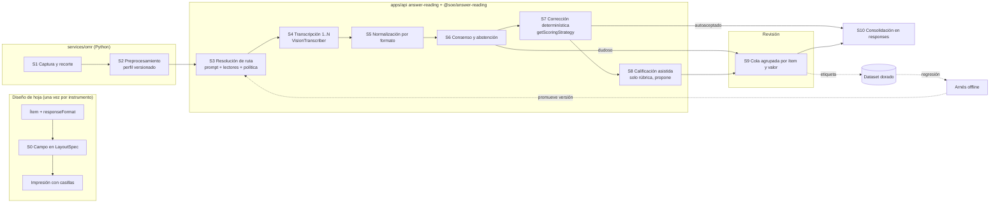
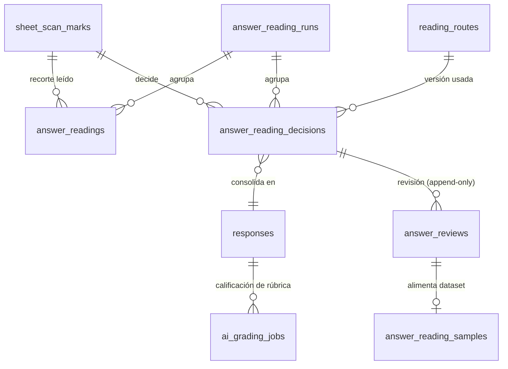

# Diseño — Corrección por visión de preguntas abiertas

> Estado: **diseño cerrado** con las decisiones de producto del 2026-10-11 (§16.3). No hay código nuevo.
> Base verificada: `origin/dev` @ `db1b7e62`. Donde la rama local difiere, manda `origin/dev`.
> Antecedentes: `docs/propuesta-correccion-respuestas-abiertas.md` (propuesta y estado del arte),
> `apps/api/scripts/probar-vlm-manuscrito.ts` (experimento con 23 recortes reales, prompts v1/v2),
> `docs/e22-lector-contracts.md` (CD-9 `crop_region`), `docs/diseno-lector-de-marcas/`.

## Índice

1. Contexto, objetivos, no objetivos y principios
2. Lo que ya existe (verificado en `origin/dev`) y lo que hay que corregir antes
3. Arquitectura por etapas
4. Contratos de cada etapa
5. Formato de respuesta (`responseFormat`)
6. Registro de prompts versionado
7. Lectores, modelos y proveedores
8. Política de consenso y enrutamiento a revisión
9. Modelo de datos
10. Integración con la corrección existente
11. UI de revisión
12. Arnés de evaluación offline y regresión
13. Observabilidad, costos y presupuesto
14. Privacidad y cumplimiento
15. Plan de implementación por PR
16. Riesgos, alternativas descartadas y decisiones abiertas

---

## 1. Contexto, objetivos, no objetivos y principios

### 1.1 Contexto

La DIA tiene 338 ítems que no son de alternativas en 97 instrumentos (169 por año). En 2026,
≈47 % tiene clave exacta (entero 30 %, negativo 3 %, decimal 2 %, fracción "o equivalente" 5 %,
par ordenado 4 %, secuencia 2 %, lista de palabras 1 %) y ≈53 % se corrige con puntaje 0–2
(multicasilla 5 %, pareados 7 %, desarrollo con rúbrica 33 %, Writing 7 %). En CSCJ, un solo
período de Monitoreo Intermedio produce ≈5.683 recortes (≈17.000 al año). Hoy esa corrección
se hace a mano sobre el cuadernillo y se tipea en la plataforma DIA.

El experimento del 2026-10-11 (23 recortes manuscritos reales, 3 repeticiones) dejó cinco
hechos que este diseño toma como requisitos:

| Hecho medido                                                                                                                               | Consecuencia de diseño                                                                                            |
| ------------------------------------------------------------------------------------------------------------------------------------------ | ----------------------------------------------------------------------------------------------------------------- |
| El prompt v2 (análisis carácter por carácter **antes** de `literal`) subió Haiku 5.5 de 48 % a 83 % y Gemini 3.5 Flash-Lite de 64 % a 84 % | El prompt es la variable más fuerte: tiene que ser versionado, medible y reemplazable sin tocar código de negocio |
| Con v2, cuando Haiku y Gemini 3.5 coincidieron (52/69), acertaron el 100 %                                                                 | El consenso entre **familias distintas** es la señal de autoaceptación                                            |
| Los dos Gemini coinciden mucho pero se equivocan igual                                                                                     | La política debe exigir proveedores/familias distintas, no solo dos lecturas                                      |
| La pista "número" hizo que Gemini 3.5 volviera a cambiar punto por coma                                                                    | Las pistas por ítem son parámetros del experimento, no una regla fija                                             |
| Gemini 3.5 con v1 tuvo 14 errores con confianza ≥ 0,9                                                                                      | La confianza autodeclarada no basta sola: se calibra con datos propios y se combina con consenso                  |

### 1.2 Objetivos

1. Corregir automáticamente, con precisión medida, los ítems de **clave exacta** escritos a mano
   en la hoja propia (números, decimales, fracciones, pares, secuencias, palabras, oraciones).
2. Mandar a revisión humana **solo lo dudoso**, en una pantalla que permita resolver en grupo
   (respuestas idénticas) y con teclado.
3. Dejar la base para el desarrollo con rúbrica (texto libre y procedimiento matemático): la
   transcripción es la misma; la calificación es una etapa aparte que **propone**.
4. Poder cambiar y medir cada pieza por separado: prompt, modelo, proveedor, preprocesamiento,
   normalización, política de consenso y corrección.
5. Trazabilidad total: cada número que llega a `responses.final_score` se puede explicar con
   el recorte, las lecturas, la versión de prompt/política y la decisión humana.

### 1.3 No objetivos

- Entrenar un modelo propio de reconocimiento (ICR). El dataset que deja este sistema lo
  habilita a futuro, pero no es parte de este trabajo.
- Corregir desde la imagen de la página completa o del cuadernillo sin layout. Solo se leen
  recortes de campos definidos en un `LayoutSpec` congelado.
- Que la IA decida puntajes de rúbrica sin aprobación docente.
- Leer pareados y secuencias con visión: van como burbujas (OMR puro), que ya existe.
- Ítems de dibujo (recta numérica, pintar figuras).
- Escaneo en tiempo real.

### 1.4 Principios

1. **Leer ≠ juzgar.** El modelo de visión solo transcribe. No recibe la clave ni la respuesta
   modelo. La corrección la hace código determinístico (`getScoringStrategy`). Fuente: el 87 %
   de los errores de calificación con LLM viene de la transcripción.
2. **La IA propone, el humano aprueba** (CLAUDE.md §8.3). Las lecturas son evidencia inmutable.
   La decisión humana se agrega, nunca reemplaza. `ai_score`, `human_score` y `final_score`
   siguen separados.
3. **Indecidible ≠ incorrecto.** Lo que no se puede leer con certeza queda pendiente, nunca 0.
   Es la misma regla que ya aplica `shortAnswerStrategy`.
4. **Desacoplado por contratos.** Cada etapa recibe y entrega un tipo Zod de `packages/types`.
   Ninguna etapa conoce el SDK de un proveedor salvo el adaptador del proveedor.
5. **Todo versionado y medible.** Prompt, esquema de salida, preprocesamiento, ruta y política
   tienen identificador y versión inmutables, y se guardan en cada lectura y cada decisión.
6. **Sin hardcodear el instrumento.** Nada dice "DIA", "Matemática" ni "4° básico" en la lógica:
   la selección de prompt usa IDs (`item`, `instrument`, `subject`, `grade`) y el formato de
   respuesta del ítem.
7. **La meta es la precisión de lo autoaceptado (≥ 99,5 %), no la tasa de automatización.**
   Aunque ~25 % vaya a revisión, el tiempo docente baja mucho respecto del cuadernillo.

---

## 2. Lo que ya existe (verificado en `origin/dev`) y lo que hay que corregir antes

### 2.1 Inventario

| Pieza                            | Ruta                                                                                                                                                                                                        | Estado                                                                                                                                                   | Decisión                                                                                                               |
| -------------------------------- | ----------------------------------------------------------------------------------------------------------------------------------------------------------------------------------------------------------- | -------------------------------------------------------------------------------------------------------------------------------------------------------- | ---------------------------------------------------------------------------------------------------------------------- |
| Campo `crop_region` en el layout | `packages/types/src/schemas/omr-layout.schema.ts` (`OMR_FIELD_KINDS`)                                                                                                                                       | Existe; `region` obligatoria                                                                                                                             | **Reutilizar** y extender con `response` (formato + geometría de casillas)                                             |
| Lector `CropRegionReader`        | `services/omr/app/readers.py`                                                                                                                                                                               | Devuelve `state: marked`, `value: null`, JPEG en `cropJpegBase64`                                                                                        | **Reutilizar**; agregar métrica de tinta y perfil de recorte                                                           |
| Codificación del recorte         | `services/omr/app/classify.py` → `crop_region_jpeg`                                                                                                                                                         | Gris, 600 px de ancho, JPEG calidad 70, sin margen                                                                                                       | **Modificar**: margen (_bleed_), ancho y calidad por perfil versionado                                                 |
| Layout automático                | `apps/api/src/sheet-scanning/sheet-layout.helpers.ts` (`SUPPORTED_ITEM_TYPES`, `partitionDerivableItems`)                                                                                                   | Solo `multiple_choice` y `true_false`; `crop_region` solo existe si el spec se arma a mano                                                               | **Modificar**: derivar campos desde `responseFormat`                                                                   |
| Impresión                        | `apps/api/src/sheet-scanning/sheet-print.helpers.ts` (`computeDrawPlan`)                                                                                                                                    | Dibuja el rectángulo del `crop_region`                                                                                                                   | **Modificar**: dibujar casillas según formato                                                                          |
| Subida de recortes               | `apps/api/src/sheet-scanning/sheet-scan.service.ts` (`purpose: 'mark_crop'`)                                                                                                                                | Sube a S3, guarda `sheet_scan_marks.crop_file_id`                                                                                                        | **Reutilizar**                                                                                                         |
| Confirmación de lote             | `apps/api/src/sheet-scanning/scan-review.service.ts` → `confirmBatch`                                                                                                                                       | Excluye las marcas de `crop_region` del `ParserResult` y luego llama a `developmentGrading.scheduleConfirmedBatch`                                       | **Modificar** (ver §2.2, bug latente)                                                                                  |
| Corrección IA de recortes        | `apps/api/src/sheet-scanning/development-grading.service.ts`                                                                                                                                                | Pide `{score, confidence, justification}` al LLM con enunciado + rúbrica; escribe `responses.ai_score`; tope 200 por lote; feature `ai_grading`          | **Separar** en transcripción + calificación (§10.3)                                                                    |
| Despachador de jobs              | `apps/api/src/jobs/job-dispatcher.ts` (`JOB_DISPATCHER`, en proceso)                                                                                                                                        | `enqueue({id, kind, run})`                                                                                                                               | **Reutilizar**                                                                                                         |
| Estrategias de corrección        | `packages/types/src/scoring/` (`getScoringStrategy`, `shortAnswerStrategy`, `rubricScoredStrategy`, `gapFillStrategy`…)                                                                                     | `short_answer` compara `numeric`/`text`/`sequence`, unidad, "indecidible"                                                                                | **Reutilizar**; extender comparadores (§10.1)                                                                          |
| Comparador de respuesta corta    | `packages/types/src/utils/short-answer.ts` (`matchesAcceptedAnswer`, `inferComparisonMode`)                                                                                                                 | En dev: `numeric`, `text`, `sequence`. `ordered_tuple` **solo** en la rama local `feat/items-autocorregibles` (commit `76538c37`), sin PR ni merge a dev | Integrar esa rama antes de la fase 2                                                                                   |
| Módulo LLM                       | `apps/api/src/llm/` (`LlmService.completeMultimodalWithUsage`, providers `anthropic`/`gemini`, `llm.pricing.ts`, `llm.constants.ts`)                                                                        | Texto plano; JSON por instrucción en el prompt                                                                                                           | **Extender** con salida estructurada (§7)                                                                              |
| Ajustes LLM por org y feature    | `packages/types/src/schemas/llm-settings.schema.ts`, tabla `llm_settings`                                                                                                                                   | `ai_grading` → `gemini-2.5-pro` por defecto                                                                                                              | Agregar feature `answer_transcription`                                                                                 |
| Ajustes de revisión por org      | `packages/types/src/schemas/feature.schema.ts` (`orgConfigSchema.review`, `aiBudgetUsd`, `omrRetentionDays`)                                                                                                | Existen                                                                                                                                                  | **Extender** con `answerReading`                                                                                       |
| Observabilidad IA                | `apps/api/src/ai-observability/ai-observability.service.ts`                                                                                                                                                 | Suma `ai_analyses`, `remedial_materials`, `assistant_messages`; **no** suma `ai_grading_jobs`                                                            | Sumar las lecturas (§13)                                                                                               |
| Precedente de motor desacoplado  | `packages/decisions` (`@soe/decisions`, contratos + `fake-engine`), `decision_settings` (global + override por org con índices parciales), `decision_calls` (registro por llamada), modos `off/shadow/live` | Existe                                                                                                                                                   | **Copiar el patrón** para lectores y rutas                                                                             |
| Gold set del OMR                 | `services/omr/goldset/` (`truth.json` por hoja, `run.py`, `report.py`)                                                                                                                                      | Existe                                                                                                                                                   | **Copiar el formato** para el dataset de transcripción                                                                 |
| UI de revisión                   | `apps/web/src/app/(dashboard)/hojas/lotes/[batchId]/revisar/` (`MarkReviewPanel.tsx` con atajos y recorte, `ReviewWizard.tsx`, `review-steps.ts`)                                                           | Existe para marcas                                                                                                                                       | **Agregar paso** "Respuestas escritas" con el mismo patrón                                                             |
| Roles                            | `packages/types/src/access-policies/sheet-scanning.ts` (`SHEET_REVIEW_ROLES`, sin `teacher`)                                                                                                                | Existe                                                                                                                                                   | Por ahora se reutiliza `SHEET_REVIEW_ROLES`. Abrir la cola a docentes se resuelve después, junto con la UX (§16.3, D1) |

### 2.2 Problemas que hay que corregir antes (o dentro de la fase 0)

1. **Bug latente: una respuesta corta leída por recorte se corrige como 0 al confirmar.**
   `confirmBatch` excluye las marcas de `crop_region` (`cropPrintedNumbers`), así que el
   ítem llega al `AnswerSheetsService.confirm` sin respuesta; `toScoringAnswer` devuelve `null`
   y `shortAnswerStrategy` devuelve `{isCorrect: false, rawScore: 0, requiresManualGrading: false}`
   con `scoredBy: 'auto'`. Hoy no se nota porque los `crop_region` solo se usan para desarrollo
   (`open_ended`/`rubric_scored` quedan pendientes). En cuanto un ítem `short_answer` tenga
   recorte, el alumno aparece con 0 hasta que algo lo pise. Arreglo: el `ParserResult` debe
   marcar esos ítems como **pendientes de lectura** (un estado explícito en `answers`, no
   ausencia) y la ingesta debe dejarlos con `isCorrect: null`, `finalScore: null`.
2. **`ai_grading_jobs` no tiene `org_id` ni política RLS** (`packages/db/src/schema/responses.ts`;
   no aparece en `packages/db/sql/rls-policies.sql`). Contradice CLAUDE.md §5.2. Se agrega
   `org_id NOT NULL` con backfill vía `responses → assessments` y su política.
3. **`responses` no tiene `org_id`**; su RLS hereda vía `assessments`. No se cambia, pero las
   tablas nuevas sí llevan `org_id` propio (consultas de cola sin join).
4. **Módulo LLM** (detalle en §7.4): Anthropic manda `temperature: 0` (Haiku 5.5 rechaza
   valores de muestreo distintos al default con 400) y no reporta `usage` en `complete*`; no usa
   salida estructurada; Gemini fija `thinkingBudget: 0`, no cuenta `thoughtsTokenCount`, y
   `@google/genai@^0.10.0` descarta `thinkingLevel` y no soporta `responseJsonSchema`;
   `llm.pricing.ts` tiene tarifas de Claude viejas (`claude-haiku` a 0,80/4; Haiku 5.5 es
   0,10/0,50 por MTok para prompts ≤ 100K); el catálogo ofrece `gemini-2.5-flash-lite`, que
   responde 404 a cuentas nuevas.
5. **El tope fijo de 200 recortes por lote** (`DEVELOPMENT_GRADING_BATCH_LIMIT`) deja recortes
   sin procesar en silencio (solo un `logger.warn`). Se reemplaza por presupuesto (§13).

---

## 3. Arquitectura por etapas

### 3.1 Vista general



### 3.2 Dónde vive cada cosa

| Capa                       | Ubicación                                                                                      | Contenido                                                                                                                                                                                               | Por qué ahí                                                                                                                                                                                                                              |
| -------------------------- | ---------------------------------------------------------------------------------------------- | ------------------------------------------------------------------------------------------------------------------------------------------------------------------------------------------------------- | ---------------------------------------------------------------------------------------------------------------------------------------------------------------------------------------------------------------------------------------- |
| Contratos                  | `packages/types/src/schemas/answer-reading/`                                                   | Zod de formato de respuesta, salida de transcripción, respuesta normalizada, `ReaderSpec`, ruta, política, decisión, revisión                                                                           | Regla del proyecto: todo Zod compartido vive en `packages/types`                                                                                                                                                                         |
| Lógica pura                | **paquete nuevo** `packages/answer-reading` (`@soe/answer-reading`)                            | Registro de formatos, normalizadores, plantillas de prompt y su renderizador, resolución de rutas (función pura sobre filas), evaluador de consenso, transcriptor falso, formato del dataset y métricas | Sin Nest, sin DB, sin SDK. Lo usan la API, el arnés offline y los tests. Mismo patrón que `@soe/decisions`. No va en `packages/types` porque carga plantillas largas y el código de métricas, que no tienen por qué viajar al bundle web |
| Proveedores                | `apps/api/src/llm/` (extendido)                                                                | Salida estructurada multimodal, uso de tokens, batch, precios                                                                                                                                           | Es el único lugar que conoce SDKs, claves y precios. Duplicarlo sería peor (§7.1)                                                                                                                                                        |
| Orquestación               | **módulo nuevo** `apps/api/src/answer-reading/`                                                | Servicios de pipeline, rutas, lecturas, consenso, revisión, consolidación, métricas; controllers de revisión y configuración                                                                            | Un módulo por dominio (CLAUDE.md §6.1). `sheet-scanning` queda como productor de recortes                                                                                                                                                |
| Recorte y preprocesamiento | `services/omr/app/`                                                                            | Perfil de recorte por formato                                                                                                                                                                           | OpenCV ya está ahí; la API no tiene librería de imágenes (no hay `sharp` en `apps/api/package.json`)                                                                                                                                     |
| UI                         | `apps/web/src/app/(dashboard)/hojas/lotes/[batchId]/revisar/` y una ruta propia por evaluación | Cola agrupada                                                                                                                                                                                           | Junto a la revisión de marcas que ya existe                                                                                                                                                                                              |
| Arnés                      | `apps/api/scripts/answer-reading-eval.ts` (evoluciona `probar-vlm-manuscrito.ts`)              | CLI de comparación                                                                                                                                                                                      | Reutiliza los proveedores reales vía contexto Nest standalone                                                                                                                                                                            |

### 3.3 Cómo se reemplaza cada pieza

Cada etapa es una función o un servicio con un contrato de entrada y salida. Para cambiar una
pieza se cambia **una** cosa y se mide con el arnés:

| Quiero cambiar…                                             | Toco…                                                                  | No toco…                     |
| ----------------------------------------------------------- | ---------------------------------------------------------------------- | ---------------------------- |
| El texto del prompt                                         | Una versión nueva en `packages/answer-reading/src/prompts/`            | Ni la API ni los proveedores |
| El modelo o proveedor de un formato                         | La fila de `reading_routes` (o una ruta nueva en modo `shadow`)        | Código                       |
| La normalización de fracciones                              | El normalizador del formato `fraction` + su test                       | Prompts, consenso            |
| El umbral de autoaceptación                                 | La política de la ruta (nueva versión)                                 | Código                       |
| El criterio de corrección                                   | La estrategia en `packages/types/src/scoring/` o el `content` del ítem | La lectura                   |
| El proveedor por uno no-LLM (Mathpix, Azure DI, ICR propio) | Un nuevo `VisionTranscriber` registrado                                | Consenso, corrección, UI     |

---

## 4. Contratos de cada etapa

Los ejemplos son contratos propuestos; los nombres de archivo son los que se crearían.

### S0 — Definición del campo de respuesta en el layout

- **Responsabilidad:** traducir el `responseFormat` del ítem a un campo de hoja con geometría
  de casillas. Congela el formato en el `LayoutSpec` (el `specHash` lo cubre: editar el formato
  después de imprimir invalida el lote, que es lo correcto).
- **Dónde:** `deriveLayoutDraft`/`partitionDerivableItems` en `sheet-layout.helpers.ts`, usando
  `ANSWER_FORMATS[kind].layout` de `@soe/answer-reading`.
- **Contrato:** extensión opcional de `omrFieldSchema` (compatible con `specVersion: 1`, porque
  el campo nuevo es opcional y los specs viejos siguen validando):

```ts
export const omrResponseBoxSchema = z.object({
  partId: z.string().min(1),
  region: omrRegionSchema,
  role: z.enum([
    'char',
    'sign',
    'decimal_separator',
    'numerator',
    'denominator',
    'tuple_component',
    'line',
    'area',
  ]),
});

export const omrFieldResponseSchema = z.object({
  itemId: z.string().uuid(),
  format: responseFormatSchema,
  boxes: z.array(omrResponseBoxSchema),
  cropProfileId: z.string().min(1),
});

export const omrFieldSchema = z.object({
  /* campos actuales sin cambios */
  response: omrFieldResponseSchema.optional(),
});
```

- **Test aislado:** snapshot del `LayoutSpec` derivado para un ítem por formato; render del PDF
  con `computeDrawPlan` comparado contra fixtures.

### S1 — Captura y recorte

- **Responsabilidad:** rectificar la página (ya existe: 4 fiduciales + homografía) y recortar
  la región del campo con margen. Medir la tinta para detectar "en blanco" sin modelo.
- **Dónde:** `CropRegionReader` en `services/omr/app/readers.py`, `crop_region_jpeg` en
  `classify.py`.
- **Contrato:** `markReadingSchema` sin cambios de forma obligatorios; se agrega, detrás del
  flag de contrato v2 que ya existe (`contract_v2_enabled`), un bloque opcional:

```ts
export const cropEvidenceSchema = z.object({
  cropProfileId: z.string(),
  inkRatio: z.number().min(0).max(1),
  inkRatioByPart: z.record(z.string(), z.number().min(0).max(1)).optional(),
  widthPx: z.number().int().positive(),
  heightPx: z.number().int().positive(),
  sha256: z.string().length(64),
});
export const markReadingSchema = /* actual */.extend({ crop: cropEvidenceSchema.nullable().optional() });
```

- `inkRatio` se calcula **después** de restar la plantilla impresa (las líneas de las casillas
  se conocen por geometría), para que una casilla vacía no cuente sus bordes como tinta.
- El `sha256` del recorte es la base de la idempotencia de las lecturas (§7.3).
- **Test aislado:** `services/omr/tests/test_crop_region.py` ya existe; se agregan casos
  sintéticos con casillas vacías, con un solo trazo y con tinta fuera de la caja.

### S2 — Preprocesamiento de imagen

- **Responsabilidad:** dejar el recorte en la forma que mejor leen los modelos: margen, ancho
  objetivo, normalización de contraste, gris, calidad JPEG. **Nunca** binarizar ni "limpiar"
  trazos en v1: es justo lo que puede borrar un punto decimal.
- **Dónde:** `services/omr`, con perfiles versionados declarados en `@soe/answer-reading`
  (`CROP_PROFILES`) y replicados como constante en Python (un test compara ambos JSON).
- **Contrato:**

```ts
export const cropProfileSchema = z.object({
  id: z.string(),
  version: z.number().int().positive(),
  bleedRatio: z.number().min(0).max(0.5),
  targetWidthPx: z.number().int().min(200).max(2000),
  jpegQuality: z.number().int().min(50).max(100),
  contrast: z.enum(['none', 'clahe']),
});
```

- Perfil inicial propuesto `short-answer@1`: 15 % de margen, 1000 px, calidad 85, sin contraste.
  Hoy el recorte sale a 600 px y calidad 70: hay que medir si eso ya basta (el experimento usó
  fotos a 1568 px de lado máximo y calidad 90).
- **Experimentación:** el arnés offline puede aplicar perfiles alternativos sobre el recorte
  maestro del dataset sin re-escanear.

### S3 — Selección de prompt y lectores (resolución de ruta)

- **Responsabilidad:** dado un recorte, elegir qué lectores corren, con qué prompt y qué
  política decide. Detalle en §6.3.
- **Dónde:** función pura `resolveReadingRoute(context, routes)` en `@soe/answer-reading`;
  `ReadingRoutesService` en la API solo carga las filas candidatas.
- **Contrato:**

```ts
export const readingContextSchema = z.object({
  orgId: z.string().uuid(),
  itemId: z.string().uuid(),
  instrumentId: z.string().uuid(),
  subjectId: z.string().uuid().nullable(),
  gradeId: z.string().uuid().nullable(),
  responseFormat: responseFormatSchema,
});

export const resolvedRouteSchema = z.object({
  routeId: z.string().uuid(),
  routeVersion: z.number().int(),
  matchedLevel: z.enum([
    'item',
    'instrument',
    'format_subject_grade',
    'format_subject',
    'format',
    'default',
  ]),
  readers: z.array(readerSpecSchema).min(1),
  shadowReaders: z.array(readerSpecSchema),
  policy: consensusPolicySchema,
});
```

### S4 — Transcripción (1..N lectores)

- **Responsabilidad:** leer el recorte y devolver un JSON estructurado. Nada más.
- **Dónde:** puerto `VisionTranscriber` en `apps/api/src/answer-reading/transcribers/`;
  implementación `LlmVisionTranscriber` sobre `LlmService.completeStructured` (§7.2);
  `FakeTranscriber` en `@soe/answer-reading` para tests.
- **Contrato del puerto:**

```ts
export interface TranscriptionRequest {
  readonly readingKey: string;
  readonly image: { mimeType: 'image/jpeg' | 'image/png'; base64: string; sha256: string };
  readonly reader: ReaderSpec;
  readonly prompt: RenderedPrompt;
  readonly outputSchema: z.ZodTypeAny;
}

export interface TranscriptionResult {
  readonly status: 'ok' | 'invalid_output' | 'refused' | 'truncated' | 'error' | 'timeout';
  readonly output: TranscriptionOutput | null;
  readonly rawText: string | null;
  readonly providerModel: string;
  readonly usage: ReadingUsage | null;
  readonly costUsd: number | null;
  readonly latencyMs: number;
  readonly errorCode: string | null;
}

export interface VisionTranscriber {
  readonly id: string;
  supports(reader: ReaderSpec): boolean;
  transcribe(request: TranscriptionRequest): Promise<TranscriptionResult>;
}
```

- **Salida (envoltorio común; `parts` depende del formato):**

```ts
export const READING_STATES = [
  'answered',
  'blank',
  'illegible',
  'crossed_out_only',
  'multiple_answers',
] as const;

export const characterAnalysisSchema = z.object({
  shape: z.string(),
  reading: z.string(),
  alternatives: z.array(z.string()),
});

export const transcriptionOutputSchema = z.object({
  characters: z.array(characterAnalysisSchema),
  state: z.enum(READING_STATES),
  literal: z.string(),
  parts: z.record(z.string(), z.string()).nullable(),
  alternativeReadings: z.array(
    z.object({
      literal: z.string(),
      parts: z.record(z.string(), z.string()).nullable(),
      plausibility: z.number().min(0).max(1),
    }),
  ),
  confidence: z.number().min(0).max(1),
  reviewRequested: z.boolean(),
  notes: z.string(),
});
```

`reviewRequested` es la forma explícita en que el lector dice "esto necesita una persona"
(trazo ambiguo, algo escrito fuera de la casilla, respuesta que no calza con el formato). La
política lo respeta siempre (§8.2, paso 4b), aunque la confianza sea alta.

El orden de las propiedades es parte del contrato: `characters` va **antes** de `literal`
(es lo que subió la exactitud en v2). Cada formato puede refinar `parts` (por ejemplo
`fraction` exige `numerator` y `denominator`) con un esquema propio que extiende este.

- **Test aislado:** el transcriptor falso devuelve salidas fijas por `sha256`; los adaptadores
  reales se prueban con el SDK mockeado por export (patrón de `.claude/rules/backend/01-testing.md`).

### S5 — Normalización por formato

- **Responsabilidad:** convertir la salida del lector en una respuesta canónica comparable,
  **sin corregir lo que el alumno escribió**. Normaliza notación (espacios, signo menos
  tipográfico, `×`→`*`, fracción vertical→`a/b`), no contenido (no simplifica, no cambia
  dígitos, no cambia coma por punto en el literal).
- **Dónde:** `ANSWER_FORMATS[kind].normalize` en `@soe/answer-reading`.
- **Contrato:**

```ts
export const normalizedAnswerSchema = z.object({
  formatKind: responseFormatKindSchema,
  state: z.enum(READING_STATES),
  canonical: z.string().nullable(),
  parts: z.record(z.string(), z.string()).nullable(),
  scoringInput: z.unknown(),
  issues: z.array(
    z.enum(['format_mismatch', 'extra_tokens', 'empty_part', 'non_numeric_in_numeric']),
  ),
});
```

- `canonical` es la clave para agrupar y para comparar lecturas entre sí.
- `scoringInput` es lo que recibe `ScoringStrategy.score` como `rawAnswer` (string para
  `short_answer`; arreglo por casilla para `gap_fill`).
- `issues` no rechaza nada: informa a la política (por ejemplo, una letra en un formato
  entero manda a revisión).
- **Test aislado:** tablas de casos por formato (entrada → canónico), incluidos los errores del
  experimento (`8` leído como `γ`, coma/punto, ceros).

### S6 — Consenso y abstención

- **Responsabilidad:** decidir si una lectura se acepta sola o va a revisión. Detalle en §8.
- **Dónde:** `evaluateConsensus(readings, policy, scoreOf)` puro en `@soe/answer-reading`.
  `scoreOf` es una función inyectada que corrige una respuesta normalizada; así el consenso
  puede preguntar "¿esta alternativa cambia el resultado?" sin conocer las estrategias.
- **Contrato:**

```ts
export const READING_OUTCOMES = [
  'auto_accepted',
  'auto_blank',
  'needs_review',
  'not_read',
] as const;

export const reviewReasonSchema = z.enum([
  'readers_disagree',
  'low_confidence',
  'alternative_flips_outcome',
  'illegible',
  'multiple_answers',
  'crossed_out',
  'undecidable',
  'format_mismatch',
  'reader_failed',
  'insufficient_readers',
  'policy_requires_review',
  'rubric_item',
  'reader_requested_review',
  'unparsed_format',
]);

export const consensusResultSchema = z.object({
  outcome: z.enum(READING_OUTCOMES),
  value: normalizedAnswerSchema.nullable(),
  reasons: z.array(reviewReasonSchema),
  usedReadingIds: z.array(z.string().uuid()),
});
```

### S7 — Corrección determinística

- **Responsabilidad:** corregir el valor aceptado. Es **el mismo** código que corrige un CSV.
- **Dónde:** `getScoringStrategy(item.type).score({ item, rawAnswer: value.scoringInput })`
  (`packages/types/src/scoring/scoring-strategy.ts`).
- **Contrato:** `ScoringInput`/`ScoringOutput` actuales, sin cambios. `requiresManualGrading:
true` (indecidible) se traduce en `needs_review` con motivo `undecidable`.

### S8 — Calificación asistida (solo rúbrica, fase posterior)

- **Responsabilidad:** con la **transcripción ya revisada o aceptada**, proponer un nivel de la
  rúbrica. Nunca escribe `final_score`.
- **Dónde:** `RubricGradingService` en `answer-reading` (sucesor del actual
  `DevelopmentGradingService`), registrando en `ai_grading_jobs` (ya con `org_id`).
- **Entrada:** transcripción (texto), enunciado, niveles de `rubricScoredContentSchema.levels`
  (código, descriptor, `creditFraction`) y ejemplos por nivel si existen. **Sin imagen** cuando
  la transcripción está confirmada (evita que el modelo "re-lea" distinto); con imagen como
  opción medible para procedimiento matemático.
- **Salida:** `{ levelCode, probabilities?, confidence, rationale, evidenceQuotes[] }`. El
  `levelCode` pasa por `rubricScoredStrategy` para obtener el puntaje. Alternativa a evaluar:
  el motor `@soe/decisions` (pregunta tipo `score` sobre el texto transcrito) da
  probabilidades calibradas por nivel; su contrato ya dice "las imágenes se transcriben antes".

### S9 — Revisión humana

- Ver §11. **Contrato de acción:**

```ts
export const ANSWER_REVIEW_ACTIONS = [
  'accept',
  'edit',
  'illegible',
  'blank',
  'crossed_out',
  'score_override',
] as const;

export const answerReviewInputSchema = z
  .object({
    decisionIds: z.array(z.string().uuid()).min(1).max(500),
    action: z.enum(ANSWER_REVIEW_ACTIONS),
    value: z
      .object({ literal: z.string(), parts: z.record(z.string(), z.string()).nullable() })
      .nullable(),
    humanScore: z.number().min(0).nullable(),
    reason: z.string().max(500).nullable(),
  })
  .strict();
```

`.strict()` a propósito: un campo mal escrito tiene que fallar, no descartarse en silencio
(ver memoria "un filtro que no filtra").

### S10 — Consolidación en `responses`

- **Responsabilidad:** escribir el resultado en `responses` respetando la disciplina ai/humano y
  recalcular resultados.
- **Dónde:** `AnswerConsolidationService` + `AssessmentResultsService.calculate` existente.
- Reglas en §10.2.

---

## 5. Formato de respuesta (`responseFormat`)

### 5.1 Qué gobierna

El formato de respuesta es **un solo dato por ítem** que decide cuatro cosas:

| Aspecto            | Ejemplo para `fraction`                                                             |
| ------------------ | ----------------------------------------------------------------------------------- |
| Cómo se imprime    | Caja de numerador sobre caja de denominador, con la raya impresa                    |
| Qué pide el lector | Esquema con `parts: {numerator, denominator}`; guía de formato en el prompt         |
| Cómo se normaliza  | `canonical = "n/d"` sin simplificar; signo al frente                                |
| Qué corrige        | `short_answer` con `comparison: 'numeric'` (equivalencia racional exacta ya existe) |

### 5.2 Modelo

```ts
export const RESPONSE_FORMAT_KINDS = [
  'integer',
  'decimal',
  'fraction',
  'ordered_tuple',
  'sequence',
  'word_list',
  'short_text',
  'multi_box',
  'free_text',
  'math_work',
  'bubble_choice',
  'score_bubbles',
] as const;

export const responseFormatSchema = z.discriminatedUnion('kind', [
  z.object({
    kind: z.literal('integer'),
    maxChars: z.number().int().min(1).max(12),
    allowNegative: z.boolean(),
  }),
  z.object({
    kind: z.literal('decimal'),
    maxChars: z.number().int().min(1).max(12),
    allowNegative: z.boolean(),
  }),
  z.object({ kind: z.literal('fraction'), allowNegative: z.boolean(), allowMixed: z.boolean() }),
  z.object({
    kind: z.literal('ordered_tuple'),
    arity: z.number().int().min(2).max(4),
    componentKind: z.enum(['integer', 'decimal', 'fraction']),
  }),
  z.object({ kind: z.literal('sequence'), length: z.number().int().min(2).max(12) }),
  z.object({ kind: z.literal('word_list'), count: z.number().int().min(1).max(10) }),
  z.object({ kind: z.literal('short_text'), maxWords: z.number().int().min(1).max(40) }),
  z.object({
    kind: z.literal('multi_box'),
    boxes: z
      .array(
        z.object({
          partId: z.string(),
          label: z.string(),
          kind: z.enum(['integer', 'decimal', 'fraction', 'short_text']),
        }),
      )
      .min(2),
  }),
  z.object({ kind: z.literal('free_text'), lines: z.number().int().min(1).max(30) }),
  z.object({ kind: z.literal('math_work'), heightRatio: z.number().min(0.05).max(1) }),
  z.object({ kind: z.literal('bubble_choice') }),
  z.object({ kind: z.literal('score_bubbles'), levels: z.array(z.string()).min(2) }),
]);
```

### 5.3 Dónde se guarda

En `items.content.responseFormat` (opcional, agregado a `baseContent` en
`packages/types/src/schemas/item-content.schema.ts`). Razones:

- Es parte de la **definición** del ítem (cómo se responde), no de su puntaje.
- `content` ya se versiona en `item_versions`; un cambio de formato queda auditado.
- Cero columnas nuevas (CLAUDE.md §4.1 Open/Closed).

Si falta, se **deriva**: `resolveResponseFormat(item)` en `@soe/answer-reading` usa el tipo,
`content.comparison` y las `acceptedAnswers` (reutiliza `inferComparisonMode`). Ejemplos:
`short_answer` con claves `21/10` → `fraction`; `(7;3)` → `ordered_tuple`; `rubric_scored` →
`free_text` (o `math_work` si la asignatura del instrumento declara procedimiento: eso es un
dato del ítem, no un `if` por asignatura). El diseñador de hojas muestra el formato derivado y
permite fijarlo; fijarlo escribe `content.responseFormat`.

### 5.4 Registro de formatos

```ts
export interface AnswerFormatDefinition<K extends ResponseFormatKind> {
  readonly kind: K;
  readonly readBy: 'vision' | 'omr';
  readonly layout: (
    format: Extract<ResponseFormat, { kind: K }>,
    box: OmrRegion,
  ) => OmrResponseBox[];
  readonly outputSchema: z.ZodTypeAny;
  readonly promptGuide: string;
  readonly normalize: (
    output: TranscriptionOutput,
    format: Extract<ResponseFormat, { kind: K }>,
  ) => NormalizedAnswer;
  readonly compatibleItemTypes: readonly ItemType[];
  readonly defaultCropProfileId: string;
}

export const ANSWER_FORMATS: { [K in ResponseFormatKind]: AnswerFormatDefinition<K> } = {
  /* … */
};
```

Agregar un formato = una entrada en el registro + su test + (si hace falta) una variante de
prompt. Igual que `SCORING_STRATEGIES`.

| Formato                          | `readBy`                             | Tipo de ítem                             | Corrección                                                                                         |
| -------------------------------- | ------------------------------------ | ---------------------------------------- | -------------------------------------------------------------------------------------------------- |
| `integer`, `decimal`, `fraction` | vision                               | `short_answer`                           | `comparison: 'numeric'`                                                                            |
| `ordered_tuple`                  | vision                               | `short_answer`                           | `comparison: 'ordered_tuple'` (rama `feat/items-autocorregibles`) + crédito por componente (§10.1) |
| `sequence`                       | omr (burbujas por posición) o vision | `ordering` / `short_answer`              | `orderingStrategy` / `sequence`                                                                    |
| `word_list`, `short_text`        | vision                               | `short_answer` (`comparison: 'text'`)    | Texto; listas como conjunto (extensión)                                                            |
| `multi_box`                      | vision                               | `gap_fill`                               | Por casilla (extensión con crédito parcial, §10.1)                                                 |
| `free_text`, `math_work`         | vision (solo transcribe)             | `rubric_scored`, `writing`, `open_ended` | Calificación asistida → docente                                                                    |
| `bubble_choice`                  | omr                                  | `matching`, `ordering`                   | Estrategias existentes                                                                             |
| `score_bubbles`                  | omr                                  | `rubric_scored`                          | El docente marca el nivel; `rubricScoredStrategy`                                                  |

### 5.5 Comparación estructurada y equivalencias por defecto

**Problema:** si la clave y la respuesta se comparan como texto, `1-2-3-4` y `1234` parecen
distintas aunque digan lo mismo, y el alumno queda con una incorrecta falsa.

**Regla (decidida, D6):** la clave (`acceptedAnswers`) y la transcripción se convierten a **la
misma estructura según el formato** antes de compararlas. El separador o la notación que use el
alumno dejan de importar.

| Formato               | Estructura canónica                  | Ejemplos que quedan iguales                                                                      |
| --------------------- | ------------------------------------ | ------------------------------------------------------------------------------------------------ |
| `integer` / `decimal` | valor decimal exacto (no `float`)    | `2,5` = `2.5` = `2,50` = `02,5`; `1.500` = `1500` = `1 500`                                      |
| `fraction`            | `{ numerator, denominator, whole? }` | `3/4`, `3` sobre `4`, `1 1/2` (número mixto)                                                     |
| `ordered_tuple`       | arreglo ordenado de componentes      | `(7;3)` = `(7,3)` = `7;3` = `7 3`                                                                |
| `sequence`            | arreglo de elementos                 | `1-2-3-4` = `1,2,3,4` = `1 2 3 4` = `1234` (este último solo si cada elemento es de un carácter) |
| `word_list`           | conjunto de palabras normalizadas    | sin mayúsculas ni tildes; orden indiferente si la pauta lo dice                                  |

- **El lector entrega partes, el código decide.** El esquema de salida pide `literal` **y**
  `parts` (por ejemplo `elements: ["1","2","3","4"]`). El normalizador vuelve a parsear el
  `literal` por su cuenta y usa `parts` solo para detectar discrepancias: el código no depende
  de lo que el modelo diga que es la estructura.
- **El modelo no recibe la clave ni la respuesta modelo** (principio 1). El enunciado del ítem
  es una variante de prompt opcional que se mide en el arnés (§12) antes de activarla.
- **Lo que no se puede convertir va a revisión, nunca a incorrecta** (`unparsed_format`,
  modo corrección, §11.2). Si el revisor la marca correcta, se genera un caso de prueba para el
  normalizador del formato (§11.4): el sistema aprende los formatos nuevos con datos reales.

**Equivalencias por defecto** (todas configurables por ítem en `scoring_config.equivalences`;
la pauta del ítem siempre manda sobre el valor por defecto):

| Formato          | Por defecto vale                                                                                                  | Configurable por ítem                                                 |
| ---------------- | ----------------------------------------------------------------------------------------------------------------- | --------------------------------------------------------------------- |
| Números          | Coma y punto decimal; ceros que no cambian el valor; punto o espacio de miles; signo menos con o sin paréntesis   | `requireExactDecimals`, `tolerance`                                   |
| Números ambiguos | `1.500` cuando puede ser miles o decimal y ambas lecturas dan resultados distintos → **revisión** (`undecidable`) | —                                                                     |
| Fracciones       | Fracciones equivalentes (`6/8` = `3/4`) cuando la pauta dice "o equivalente"; número mixto ↔ impropia             | `requireSimplified`, `acceptDecimalEquivalent` (por defecto **no**)   |
| Unidades         | Si la unidad viene impresa en la hoja se ignora; si el alumno la escribe y es correcta, también vale              | Unidad distinta a la esperada → **revisión**                          |
| Pares ordenados  | El orden importa; el separador no                                                                                 | `partialCredit` por componente **solo si la pauta lo indica** (§10.1) |
| Secuencias       | Cualquier separador                                                                                               | —                                                                     |
| Palabras         | Sin mayúsculas ni tildes; sinónimos y faltas solo si están en `acceptedAnswers`                                   | Si no calza, **revisión** (en Lenguaje conviene ser conservador)      |

```ts
export const equivalencesSchema = z.object({
  requireExactDecimals: z.boolean().optional(),
  tolerance: z.number().nonnegative().optional(),
  requireSimplified: z.boolean().optional(),
  acceptDecimalEquivalent: z.boolean().optional(),
  ignoreUnit: z.boolean().optional(),
  unordered: z.boolean().optional(),
});
```

Implementación: `matchesAcceptedAnswer` (`packages/types/src/utils/short-answer.ts`) pasa a
comparar estructuras canónicas en vez de strings, reutilizando los parsers de
`@soe/answer-reading`. Es un cambio a la corrección existente que también beneficia la ingesta
por CSV (GradeCam manda `"3 45"` o `"2-3-4-5"`).

---

## 6. Registro de prompts versionado

### 6.1 Dónde viven: en el código, inmutables

| Opción                                                       | A favor                                                                                                                  | En contra                                                                                                                                  | Veredicto                                                  |
| ------------------------------------------------------------ | ------------------------------------------------------------------------------------------------------------------------ | ------------------------------------------------------------------------------------------------------------------------------------------ | ---------------------------------------------------------- |
| Archivos en el repo (`packages/answer-reading/src/prompts/`) | Revisión por PR, tipado, hash determinístico, el arnés corre sobre la misma fuente, sin inyección en tiempo de ejecución | Cambiar un prompt requiere desplegar                                                                                                       | **Elegida**                                                |
| Tabla en BDD editable desde un panel                         | Cambios sin despliegue                                                                                                   | Prompts sin revisión ni medición; difícil de reproducir en el arnés; riesgo de que alguien "arregle" un prompt en producción sin regresión | Descartada para el texto                                   |
| Híbrido                                                      | —                                                                                                                        | —                                                                                                                                          | Lo que sí va a BDD es **qué** versión se usa (rutas, §6.3) |

Exigir un PR para cambiar un prompt es una ventaja: obliga a pasar por el arnés (§12).

### 6.2 Estructura de una versión

```ts
export const promptVersionSchema = z.object({
  id: z.string().regex(/^[a-z0-9-]+(\.[a-z0-9-]+)*$/),
  version: z.number().int().positive(),
  purpose: z.enum(['transcription', 'rubric_grading']),
  formatKinds: z.array(responseFormatKindSchema).min(1),
  outputSchemaId: z.string(),
  variables: z.array(
    z.enum([
      'formatLabel',
      'formatGuide',
      'subjectName',
      'gradeName',
      'languageName',
      'stem',
      'unit',
      'partLabels',
    ]),
  ),
  system: z.string().min(1),
  user: z.string().min(1),
  status: z.enum(['draft', 'published', 'retired']),
});
```

- **Identificador:** `"{id}@{version}"`, por ejemplo `transcribe.short-answer@2`.
- **Hash:** `sha256(system + user + outputSchemaId + JSON del esquema de salida)`. Se guarda en
  cada lectura (`prompt_hash`).
- **Inmutabilidad:** `packages/answer-reading/src/prompts/prompts.lock.json` guarda el hash de
  cada versión `published`. Un test falla si una versión publicada cambia de hash. Corregir un
  prompt = crear `@3`.
- **Variables permitidas:** lista cerrada. **Nunca** hay variables con datos del alumno. La
  clave y la respuesta modelo no existen como variables en prompts de transcripción (se valida
  en el test: un prompt `transcription` que declare una variable de clave no compila).
- `stem` (enunciado) existe como variable, pero **apagada** en las rutas por defecto: el riesgo
  es inducir a leer lo esperado. Se activa solo si el arnés muestra mejora sin aumentar la
  sobrecorrección.
- Las pistas por ítem ("número", "fracción") son `formatLabel`/`formatGuide`; la ruta decide si
  se envían (`hints: 'none' | 'format'`), porque el experimento mostró que pueden empeorar.

### 6.3 Plantilla de ejemplo (`transcribe.short-answer@2`, basada en el prompt v2 del experimento)

```text
[system]
Eres un transcriptor experto de respuestas manuscritas en pruebas escolares. La imagen es el
recorte de UNA casilla de respuesta, escrita a mano por un estudiante{{#gradeName}} de {{gradeName}}{{/gradeName}}.
Tu transcripción la usará otro sistema para corregir; tu trabajo NO es corregir, sino leer con exactitud.

REGLAS DE FIDELIDAD
- Copia exactamente lo que el estudiante escribió, aunque sea un error o tenga un formato raro.
  No corrijas, no completes, no simplifiques, no calcules y no evalúes.
- Conserva los ceros a la izquierda y a la derecha.
- Conserva el separador tal como está escrito, sea coma o punto. Nunca cambies uno por otro.
- Un trazo corto cerca de la línea base, entre dos dígitos, es un separador: transcríbelo.

CÓMO LEER
Primero analiza cada carácter de izquierda a derecha en "characters". Solo después escribe
"literal", que debe coincidir con ese análisis.

{{formatGuide}}

VARIANTES FRECUENTES EN ESCRITURA INFANTIL
- 8 abierto arriba puede parecer γ, y, P o un 7 con lazo. 1 con trazo inicial largo puede parecer ^ o 7.
- 2 puede parecer Z. 4 abierto puede parecer u o y. 5 puede parecer S. 9 puede parecer g o q. 0 puede parecer o.
Si un trazo puede ser dígito o letra y la respuesta es numérica, léelo como dígito y registra la letra como alternativa.

ESTADOS: "blank", "illegible", "crossed_out_only", "multiple_answers", "answered".

CONFIANZA
"confidence" es la probabilidad de que "literal" sea exactamente correcto, carácter por
carácter. Si algún carácter tiene una alternativa plausible, la confianza debe ser 0,7 o menos
y debes incluir la transcripción completa alternativa en "alternativeReadings".

Escribe "notes" en español, en una frase breve.

[user]
Transcribe la respuesta manuscrita de esta casilla siguiendo las instrucciones.
{{#formatLabel}}Tipo de respuesta que pide la pregunta: {{formatLabel}}. Úsalo para interpretar trazos ambiguos, pero transcribe lo que el estudiante escribió aunque no calce.{{/formatLabel}}
```

`formatGuide` sale de `ANSWER_FORMATS[kind].promptGuide` (por ejemplo, para `fraction`:
"Las fracciones se escriben numerador/denominador y se informan también en `parts`").
El renderizador es una función pura sin lógica (sustitución y secciones opcionales); el
resultado renderizado se guarda **solo como hash**, no completo, en cada lectura.

### 6.4 Selección con precedencia

`reading_routes` (§9) guarda reglas con alcance. Orden de resolución, de más a menos específico:

1. `item`
2. `instrument`
3. `format + subject + grade`
4. `format + subject`
5. `format`
6. `default`

En el mismo nivel, una fila de la organización gana a una global. Las restricciones de la
organización (proveedores permitidos, interruptor de imágenes, presupuesto) **no** son rutas:
se aplican después como filtro. Si el filtro deja la ruta sin lectores suficientes, se usan
los `fallbackReaders` declarados en la ruta; si tampoco alcanza, el resultado es `not_read`
(va a revisión humana sin lecturas, nunca se inventa un lector).

```ts
export const readerSpecSchema = z.object({
  key: z.string(),
  transcriberId: z.string(),
  provider: z.enum(['anthropic', 'gemini', 'openai', 'vertex_gemini', 'bedrock_anthropic']),
  family: z.string(),
  model: z.string(),
  promptRef: z.string().regex(/^[a-z0-9.-]+@\d+$/),
  hints: z.enum(['none', 'format']),
  params: z.object({
    maxOutputTokens: z.number().int().positive(),
    reasoning: z.enum(['off', 'low', 'medium']),
    mediaResolution: z.enum(['low', 'medium', 'high']).optional(),
    timeoutMs: z.number().int().positive(),
  }),
});
```

### 6.5 Experimentación sin afectar producción

- **Shadow (por defecto):** la ruta lista `shadowReaders`. Corren sobre los mismos recortes, se
  guardan con `mode = 'shadow'`, **no** entran al consenso. Se puede fijar una tasa de muestreo
  (`shadowSampleRate`) para acotar el costo. La comparación es pareada (mismo recorte), que es
  la más sensible.
- **Arnés offline (§12):** obligatorio antes de promover cualquier versión.
- **A/B real:** no se recomienda al inicio. Con shadow se mide lo mismo sin exponer alumnos a una
  variante peor. Si más adelante se necesita, la ruta admite `variants[]` con asignación
  determinística por `hash(markId)`.
- **Promoción:** una ruta nueva nace `shadow`; pasa a `active` con un cambio de estado
  registrado (quién, cuándo, informe del arnés adjunto en `notes`). La anterior queda `retired`.

### 6.6 Trazabilidad

Cada fila de `answer_readings` guarda: `prompt_ref`, `prompt_hash`, `output_schema_id`,
`crop_profile_id`, `route_id` + versión, `provider`, `model` pedido y `provider_model`
reportado, `params`, uso de tokens (entrada, salida, razonamiento, imagen, caché), costo,
latencia, intento y estado. Cada decisión guarda la versión de política.

---

## 7. Lectores, modelos y proveedores

### 7.1 Decisión: extender `apps/api/src/llm/`, no crear otro módulo de proveedores

- Ese módulo ya resuelve claves, disponibilidad, configuración por organización y feature,
  y precios. Un segundo módulo duplicaría secretos, precios y la lógica de `llm_settings`.
- Lo que falta (salida estructurada, uso de tokens completo, batch) también lo necesitan otras
  features (`remedial_judge`, análisis).
- El desacople que importa está **un nivel más arriba**: `answer-reading` no habla con
  `LlmService` directamente, sino con el puerto `VisionTranscriber`. `LlmVisionTranscriber` es
  un adaptador. Un lector no-LLM (Mathpix, Azure Document Intelligence, ICR propio) es otro
  adaptador del mismo puerto, sin tocar `llm/`.

### 7.2 Capacidad nueva en `LlmProvider`

```ts
export interface LlmStructuredRequest {
  system: string;
  prompt: string;
  images: LlmImagePart[];
  jsonSchema: Record<string, unknown>;
  schemaName: string;
  propertyOrder: string[];
  options: {
    model: string;
    maxTokens: number;
    reasoning: 'off' | 'low' | 'medium';
    mediaResolution?: 'low' | 'medium' | 'high';
    timeoutMs: number;
  };
}

export interface LlmStructuredResult {
  data: unknown;
  rawText: string;
  model: string;
  finishReason: 'stop' | 'max_tokens' | 'refusal' | 'safety' | 'other';
  usage: {
    inputTokens: number;
    outputTokens: number;
    reasoningTokens: number;
    cachedInputTokens: number;
    imageTokens: number | null;
  } | null;
  providerRequestId: string | null;
}

export interface LlmProvider {
  /* métodos actuales */
  completeStructured?(request: LlmStructuredRequest): Promise<LlmStructuredResult>;
  submitStructuredBatch?(
    requests: Array<{ customId: string; request: LlmStructuredRequest }>,
  ): Promise<{ batchId: string }>;
  fetchStructuredBatch?(
    batchId: string,
  ): Promise<{
    done: boolean;
    results: Array<{ customId: string; result: LlmStructuredResult | { error: string } }>;
  }>;
}
```

- El esquema JSON se genera desde Zod con `zod-to-json-schema` (ya es dependencia de
  `apps/api` y `packages/types`), así hay **una** fuente por formato en vez de dos esquemas a
  mano como en el script.
- `data` se vuelve a validar con Zod en `LlmVisionTranscriber` aunque el proveedor garantice el
  esquema: si falla, `status = 'invalid_output'` (nunca se repara un JSON a mano).
- `reasoning: 'off'` es el valor por defecto para transcribir; cada adaptador lo traduce.

### 7.3 Idempotencia, reintentos, tiempos y batch

- **Clave de idempotencia:** `readingKey = sha256(crop.sha256 + reader.key + promptHash + cropProfileId)`.
  Índice único parcial `(org_id, reading_key) WHERE status = 'ok' AND mode = 'live'`. Reprocesar
  un lote no vuelve a pagar lecturas exitosas.
- **Reintentos:** solo para errores transitorios (429, 5xx, timeout, conexión), con backoff
  exponencial y tope de 2. `invalid_output` y `refused` **no** se reintentan con el mismo
  lector: van a la política (`reader_failed`), que puede activar un lector de respaldo.
- **Timeout por lectura:** del `ReaderSpec` (15 s propuesto para transcripción en línea).
- **Concurrencia:** limitador por proveedor y por organización (existe
  `apps/api/src/decisions/concurrency-limiter.ts`; se promueve a un lugar compartido si se
  reutiliza, según `.claude/rules/backend/03-helpers-vs-services.md`).
- **Batch (−50 %):** la corrección de un lote no necesita respuesta en segundos. La ruta decide
  `delivery: 'online' | 'batch'`. En batch, el run queda `waiting_provider` y un job periódico
  consulta el estado. Excepción: OpenAI Batch no es compatible con ZDR, así que no se usa con
  organizaciones que exijan cero retención.

### 7.4 Arreglos necesarios al módulo LLM actual

| Problema                                                                           | Archivo                                               | Arreglo                                                                                                                                                                                                                                            |
| ---------------------------------------------------------------------------------- | ----------------------------------------------------- | -------------------------------------------------------------------------------------------------------------------------------------------------------------------------------------------------------------------------------------------------- |
| `temperature: 0` siempre; Haiku 5.5 responde 400 a muestreo no default             | `providers/anthropic.provider.ts`, `llm.constants.ts` | `temperature` opcional y omitido por defecto; el catálogo declara por modelo si acepta muestreo                                                                                                                                                    |
| Anthropic no reporta uso en `complete`/`completeMultimodal`                        | `providers/anthropic.provider.ts`                     | Implementar `completeWithUsage`/`completeMultimodalWithUsage`/`completeStructured` leyendo `usage` (entrada, salida, caché)                                                                                                                        |
| Sin salida estructurada en Anthropic                                               | idem                                                  | `output_config: { format: { type: 'json_schema', schema } }`; en Haiku 5.5 el razonamiento viene activo por defecto: para transcribir, `thinking: { type: 'disabled' }` (aceptado con effort `high` o menor) o effort bajo, a decidir con el arnés |
| Gemini: `thinkingBudget: 0` fijo, no cuenta `thoughtsTokenCount`                   | `providers/gemini.provider.ts`                        | Mapear `reasoning` a `thinkingLevel` en modelos 3.x y a `thinkingBudget` en 2.5; sumar `thoughtsTokenCount` a `reasoningTokens` y al costo                                                                                                         |
| `@google/genai@^0.10.0` descarta `thinkingLevel` y no soporta `responseJsonSchema` | `apps/api/package.json`                               | Subir el SDK a una versión que soporte ambos (verificar la versión exacta y su antigüedad en el PR); usar `responseJsonSchema` + `mediaResolution`. Mientras tanto, `responseSchema` con `propertyOrdering`                                        |
| Tarifas viejas                                                                     | `llm.pricing.ts`                                      | Tarifas por **modelo exacto** con fecha de verificación (Haiku 5.5: 0,10/0,50 por MTok ≤ 100K de prompt), precio de razonamiento y descuento batch. Agregar `gemini-3.x`                                                                           |
| `gemini-2.5-flash-lite` da 404 a cuentas nuevas                                    | `llm-settings.schema.ts` (`LLM_MODEL_CATALOG`)        | Retirarlo del catálogo y agregar los modelos medidos                                                                                                                                                                                               |
| Sin proveedor OpenAI                                                               | `llm.constants.ts` lo declara como extensión          | `providers/openai.provider.ts` con `completeStructured` (Structured Outputs). Hace falta un tercer proveedor para el consenso entre familias si una organización excluye a uno                                                                     |
| Proveedores para menores                                                           | —                                                     | Adaptadores `vertex_gemini` y `bedrock_anthropic` (mismo puerto, otra credencial), por los términos de Gemini API (§14)                                                                                                                            |
| Feature por funcionalidad                                                          | `LLM_FEATURES`                                        | Agregar `answer_transcription` (separada de `ai_grading`). La ruta manda sobre `llm_settings`; `llm_settings` queda como default de modelo para lectores que no fijan uno                                                                          |

---

## 8. Política de consenso y enrutamiento a revisión

### 8.1 Esquema

```ts
export const consensusPolicySchema = z.object({
  id: z.string(),
  version: z.number().int().positive(),
  minReaders: z.number().int().min(1).max(4),
  requireDistinctFamilies: z.boolean(),
  agreeOn: z.enum(['canonical', 'scoring_outcome']),
  minConfidence: z.number().min(0).max(1),
  alternativePlausibilityFloor: z.number().min(0).max(1),
  blankByInkBelow: z.number().min(0).max(1).nullable(),
  onDisagreement: z.enum(['review', 'tiebreak_reader']),
  tiebreakReader: readerSpecSchema.nullable(),
  autoAccept: z.boolean(),
  autoAcceptOutcomes: z.array(z.enum(['correct', 'incorrect'])),
  auditSampleRate: z.number().min(0).max(1),
});
```

### 8.2 Algoritmo (función pura)

```text
1. Si inkRatio < blankByInkBelow           → auto_blank (sin llamar modelos; ahorro y cero alucinación)
2. Lecturas válidas < minReaders           → needs_review [insufficient_readers | reader_failed]
3. Si requireDistinctFamilies y las familias no son distintas → needs_review [insufficient_readers]
4. Algún estado ≠ answered:
     todos 'blank'                          → auto_blank si la política lo permite; si no, review
     'illegible' / 'multiple_answers' / 'crossed_out_only' → needs_review [motivo]
4b. Algún lector con reviewRequested = true → needs_review [reader_requested_review]
5. Normalizar (§5.5); si no se puede convertir a la estructura del formato
                                            → needs_review [unparsed_format]  (nunca incorrecta)
6. Acuerdo (canonical o resultado de corrección) entre todas las lecturas:
     no hay acuerdo → tiebreak_reader (si está configurado) o needs_review [readers_disagree]
7. Alguna lectura con confidence < minConfidence → needs_review [low_confidence]
8. Para cada alternativa con plausibilidad ≥ floor: corregirla; si cambia el resultado
                                            → needs_review [alternative_flips_outcome]
9. Corregir el valor acordado: indecidible  → needs_review [undecidable]
10. autoAccept = false o el resultado no está en autoAcceptOutcomes → needs_review [policy_requires_review]
11. auto_accepted
```

Notas:

- El paso 8 es el más importante: una alternativa que no cambia el resultado (`3,9` vs `3,4`
  cuando la clave es `5`) no necesita humano; una que lo cambia, sí.
- `agreeOn: 'scoring_outcome'` acepta lecturas distintas que llevan al mismo resultado. Es
  más agresivo; queda disponible pero la política inicial usa `canonical`.
- `autoAcceptOutcomes`: **decidido** `['correct', 'incorrect']` (D5). Se autoaceptan correctas e
  incorrectas cuando hay consenso, confianza suficiente y ningún lector pidió revisión. Queda
  configurable por si un formato necesita ser más estricto.
- **Auditoría en vez de revisión total:** desde el piloto se autoacepta (D5), pero un porcentaje
  de lo autoaceptado (`auditSampleRate`, inicial 10 %) se manda a la cola marcado como
  auditoría. Así se mide la precisión real sin frenar la operación; si un formato cae bajo la
  meta, su política pasa a `autoAccept: false` sin desplegar código.
- La política por defecto es por formato (por ejemplo, `word_list` con umbral distinto de
  `integer`) y se ajusta por organización solo en dirección **más estricta** (la org puede
  pedir revisar todo; no puede bajar el umbral global sin pasar por plataforma).

### 8.3 Política inicial propuesta (a calibrar)

| Parámetro                 | Valor                                                                        | Base                                                   |
| ------------------------- | ---------------------------------------------------------------------------- | ------------------------------------------------------ |
| `minReaders`              | 2                                                                            | Doble lectura medida                                   |
| `requireDistinctFamilies` | `true`                                                                       | Errores correlacionados entre Gemini                   |
| Lectores                  | Claude Haiku 5.5 + Gemini 3.5 Flash-Lite, prompt `transcribe.short-answer@2` | 83 % / 84 %; 52/52 correctas cuando coinciden          |
| `agreeOn`                 | `canonical`                                                                  | Conservador                                            |
| `minConfidence`           | 0,85                                                                         | 0 errores con confianza alta en v2; calibrar           |
| `blankByInkBelow`         | a medir con el gold set del OMR                                              | —                                                      |
| `autoAccept`              | `true`                                                                       | Decisión D5                                            |
| `autoAcceptOutcomes`      | `['correct', 'incorrect']`                                                   | Decisión D5                                            |
| `auditSampleRate`         | 0,10                                                                         | Medir la precisión de lo autoaceptado sin revisar todo |

Con la tasa de coincidencia observada (52/69 ≈ 75 %), cerca de un cuarto iría a revisión.

---

## 9. Modelo de datos

Todas las tablas nuevas llevan `id uuid defaultRandom`, `org_id uuid NOT NULL` (salvo las de
configuración global, que admiten `NULL` como `llm_settings`), `created_at`, relaciones Drizzle,
JSONB con `.$type<T>()` y política en `packages/db/sql/rls-policies.sql` con
`FORCE ROW LEVEL SECURITY`. Archivo de schema nuevo: `packages/db/src/schema/answer-reading.ts`.

### 9.1 Diagrama



### 9.2 Tablas

**`answer_reading_runs`** — una ejecución del pipeline (polling desde el frontend, CLAUDE.md §12).

| Columna                                                      | Tipo                             | Nota                                                                               |
| ------------------------------------------------------------ | -------------------------------- | ---------------------------------------------------------------------------------- |
| `batch_id`                                                   | uuid → `sheet_scan_batches`      | nullable (reprocesos manuales)                                                     |
| `assessment_id`                                              | uuid → `assessments`             |                                                                                    |
| `trigger`                                                    | text enum                        | `batch_confirmed`, `manual_rerun`, `route_change`, `backfill`                      |
| `status`                                                     | enum `answer_reading_run_status` | `pending`, `running`, `waiting_provider`, `completed`, `failed`, `budget_exceeded` |
| `crops_total`, `crops_done`, `auto_accepted`, `needs_review` | integer                          | progreso y resumen                                                                 |
| `cost_usd`                                                   | decimal(10,6)                    | suma de lecturas                                                                   |
| `failure_reason`                                             | text                             |                                                                                    |
| `created_by_id`, `started_at`, `completed_at`, `updated_at`  |                                  |                                                                                    |

**`answer_readings`** — evidencia inmutable; una fila por intento de un lector sobre un recorte.
Nunca se actualiza después de `status` final.

| Columna                                                                         | Tipo                                                            | Nota                                                               |
| ------------------------------------------------------------------------------- | --------------------------------------------------------------- | ------------------------------------------------------------------ |
| `run_id`                                                                        | uuid → `answer_reading_runs`                                    |                                                                    |
| `mark_id`                                                                       | uuid → `sheet_scan_marks` (`onDelete: cascade` como las marcas) |                                                                    |
| `crop_file_id`                                                                  | uuid → `files`                                                  |                                                                    |
| `crop_sha256`, `crop_profile_id`                                                | text                                                            |                                                                    |
| `item_id`                                                                       | uuid → `items`                                                  |                                                                    |
| `response_format`                                                               | jsonb `.$type<ResponseFormat>()`                                | snapshot del layout                                                |
| `route_id`, `route_version`                                                     | uuid, int                                                       |                                                                    |
| `reader_key`, `transcriber_id`, `provider`, `family`, `model`, `provider_model` | text                                                            |                                                                    |
| `prompt_ref`, `prompt_hash`, `output_schema_id`                                 | text                                                            |                                                                    |
| `params`                                                                        | jsonb `.$type<ReaderSpec['params']>()`                          |                                                                    |
| `mode`                                                                          | enum `reading_mode`                                             | `live`, `shadow`                                                   |
| `reading_key`                                                                   | text                                                            | idempotencia (§7.3)                                                |
| `attempt`                                                                       | integer                                                         |                                                                    |
| `status`                                                                        | enum `reading_status`                                           | `ok`, `invalid_output`, `refused`, `truncated`, `error`, `timeout` |
| `output`                                                                        | jsonb `.$type<TranscriptionOutput>()`                           | salida validada                                                    |
| `reading_state`, `literal`, `confidence`                                        | enum, text, decimal(4,3)                                        | columnas tipadas para filtrar                                      |
| `normalized`                                                                    | jsonb `.$type<NormalizedAnswer>()`                              |                                                                    |
| `usage`                                                                         | jsonb `.$type<ReadingUsage>()`                                  |                                                                    |
| `cost_usd`                                                                      | decimal(10,6)                                                   |                                                                    |
| `latency_ms`                                                                    | integer                                                         |                                                                    |
| `error_code`                                                                    | text                                                            |                                                                    |
| `provider_batch_id`                                                             | text                                                            |                                                                    |

Índices: `(org_id, run_id)`, `(org_id, mark_id)`, único parcial `(org_id, reading_key) WHERE
status = 'ok' AND mode = 'live'`, `(org_id, prompt_ref, created_at)` para métricas.
No se guarda el `rawText` completo por defecto (solo cuando `status = 'invalid_output'`, para
depurar), para no duplicar almacenamiento.

**`answer_reading_decisions`** — resultado de aplicar la política. Una por recorte vigente;
reevaluar crea otra y marca `superseded_by_id` en la anterior (no se borra nada).

| Columna                                                       | Tipo                                       | Nota                                                       |
| ------------------------------------------------------------- | ------------------------------------------ | ---------------------------------------------------------- |
| `run_id`, `mark_id`, `item_id`, `student_id`, `assessment_id` | uuid                                       | `student_id` para consolidar; **nunca** viaja al proveedor |
| `response_id`                                                 | uuid → `responses`                         | nullable hasta consolidar                                  |
| `route_id`, `route_version`, `policy_id`, `policy_version`    |                                            |                                                            |
| `outcome`                                                     | enum `reading_outcome`                     | `auto_accepted`, `auto_blank`, `needs_review`, `not_read`  |
| `reasons`                                                     | jsonb `.$type<ReviewReason[]>()`           |                                                            |
| `value`                                                       | jsonb `.$type<NormalizedAnswer \| null>()` | valor de consenso                                          |
| `reading_ids`                                                 | jsonb `.$type<string[]>()`                 | lecturas usadas                                            |
| `proposal`                                                    | jsonb `.$type<ScoringOutput>()`            | corrección del valor de consenso                           |
| `group_key`                                                   | text                                       | `sha256(item_id + canonical)`; agrupa idénticas            |
| `resolved_at`                                                 | timestamp                                  | lo fija la consolidación                                   |
| `superseded_by_id`                                            | uuid                                       |                                                            |

Índices: `(org_id, assessment_id, outcome)` para la cola, `(org_id, item_id, group_key)` para
agrupar, único parcial `(org_id, mark_id) WHERE superseded_by_id IS NULL`.

**`answer_reviews`** — decisiones humanas, solo se agregan.

| Columna                         | Tipo                                       | Nota                                                                          |
| ------------------------------- | ------------------------------------------ | ----------------------------------------------------------------------------- |
| `decision_id`                   | uuid → `answer_reading_decisions`          |                                                                               |
| `action`                        | enum `answer_review_action`                | `accept`, `edit`, `illegible`, `blank`, `crossed_out`, `score_override`       |
| `value`                         | jsonb `.$type<NormalizedAnswer \| null>()` | lo que el humano dice que está escrito                                        |
| `human_score`                   | decimal(7,2)                               | solo `score_override` y rúbrica                                               |
| `reason`                        | text                                       |                                                                               |
| `applied_via`                   | enum                                       | `single`, `group`                                                             |
| `group_operation_id`            | uuid                                       | todas las filas de una acción de grupo comparten este id (deshacer en bloque) |
| `reviewed_by_id`, `reviewed_at` |                                            |                                                                               |
| `superseded_by_id`              | uuid                                       | una corrección posterior agrega otra fila                                     |

**`reading_routes`** — configuración versionada (global o por org), patrón de `decision_settings`.

| Columna                                                                      | Tipo                              | Nota                           |
| ---------------------------------------------------------------------------- | --------------------------------- | ------------------------------ |
| `org_id`                                                                     | uuid nullable                     | `NULL` = global                |
| `scope_item_id`, `scope_instrument_id`, `scope_subject_id`, `scope_grade_id` | uuid nullable                     | columnas tipadas (se filtran)  |
| `scope_format_kind`                                                          | text nullable                     |                                |
| `readers`, `shadow_readers`, `fallback_readers`                              | jsonb `.$type<ReaderSpec[]>()`    |                                |
| `shadow_sample_rate`                                                         | decimal(4,3)                      |                                |
| `policy`                                                                     | jsonb `.$type<ConsensusPolicy>()` |                                |
| `delivery`                                                                   | text                              | `online`, `batch`              |
| `status`                                                                     | enum `reading_route_status`       | `shadow`, `active`, `retired`  |
| `version`, `supersedes_id`                                                   |                                   | inmutable: editar = fila nueva |
| `notes`                                                                      | text                              | enlace al informe del arnés    |
| `created_by_id`, `activated_at`, `retired_at`                                |                                   |                                |

RLS como `llm_settings`: `org_id IS NULL OR org_id = current_org`. Escribir filas globales
solo con rol `platform_admin` en el guard (la misma nota que ya tiene `llm_settings` en
`rls-policies.sql`).

**`answer_reading_samples`** — dataset dorado (§12).

| Columna                                  | Tipo                                                                                             | Nota                                                     |
| ---------------------------------------- | ------------------------------------------------------------------------------------------------ | -------------------------------------------------------- |
| `source_review_id`                       | uuid → `answer_reviews`                                                                          | nullable si viene de anotación dedicada                  |
| `crop_file_id`                           | uuid → `files`                                                                                   | **copia** del recorte con su propia retención (§14)      |
| `crop_sha256`, `crop_profile_id`         | text                                                                                             |                                                          |
| `item_id`, `response_format`             |                                                                                                  |                                                          |
| `subject_id`, `grade_id`                 | uuid                                                                                             | estratos                                                 |
| `truth`                                  | jsonb `.$type<{ state: ReadingState; literal: string; parts: Record<string,string> \| null }>()` |                                                          |
| `truth_source`                           | text                                                                                             | `review_edit`, `review_accept`, `double_annotation`      |
| `annotator_count`, `annotator_agreement` |                                                                                                  |                                                          |
| `split`                                  | text                                                                                             | `dev`, `test` (el `test` no se usa para ajustar prompts) |
| `consent_scope`                          | text                                                                                             | `org_internal`, `platform_eval`                          |
| `deleted_at`                             | timestamp                                                                                        | soft delete                                              |

### 9.3 Cambios a tablas existentes

| Tabla                  | Cambio                                                                                                                                                                                                                                                          |
| ---------------------- | --------------------------------------------------------------------------------------------------------------------------------------------------------------------------------------------------------------------------------------------------------------- |
| `ai_grading_jobs`      | `org_id NOT NULL` (backfill por `responses → assessments`) + política RLS + `transcription_decision_id` nullable (la calificación de rúbrica apunta a la transcripción que usó). Se mantiene para la calificación asistida (S8), que es lo que su nombre dice   |
| `responses`            | Sin columnas nuevas. `value` agrega `reading: { decisionId, canonical }` (jsonb ya tipado como `Record<string, unknown>`)                                                                                                                                       |
| `sheet_scan_marks`     | Sin cambios. Las marcas de `crop_region` siguen con `value = null`; su "valor" vive en las decisiones. `reviewedValue`/`reviewDecision` se dejan para burbujas: mezclar las dos semánticas confundiría las métricas de revisión de marcas (CD-9 ya las excluye) |
| `organizations.config` | `answerReading` (§14.3) en `orgConfigSchema`                                                                                                                                                                                                                    |

---

## 10. Integración con la corrección existente

### 10.1 Reutilizar las estrategias y extender lo justo

- `short_answer`: integrar `feat/items-autocorregibles` (comparadores `ordered_tuple` y
  `sequence` mejorado, 72 ítems convertidos, validación contra informes). Es prerrequisito.
- **Crédito parcial por componente** en pares ordenados: **decidido** que se define por ítem
  según su pauta, y si la pauta no lo indica no hay crédito parcial (D6). Para la DIA se carga
  desde la ficha técnica (la Agencia lo dio en II° medio P12 y no lo dio con coordenadas
  invertidas en 7° P18). Extensión de `shortAnswerStrategy` gobernada por
  `scoringConfig.partialCredit` + `componentCredit` en el contenido, comparando la estructura
  canónica de §5.5. Así el resultado cuadra con el informe oficial, que es nuestro oráculo.
- `gap_fill` hoy es todo o nada y compara texto (`gapFillStrategy`). Para `multi_box` 0–2 pts:
  agregar `comparison` por casilla (reutilizando `matchesAcceptedAnswer`) y crédito por casilla
  bajo `scoringConfig.partialCredit`. Mismo patrón que `matching.pointsPerPair`.
- Ninguna estrategia conoce la visión: reciben `rawAnswer` como hoy.

### 10.2 Consolidación en `responses`

| Caso                        | `ai_score`                                                            | `human_score`                              | `final_score` / `raw_score` / `is_correct` | `scored_by` |
| --------------------------- | --------------------------------------------------------------------- | ------------------------------------------ | ------------------------------------------ | ----------- |
| `auto_accepted`             | `{ score, confidence: min de lectores, model: "a+b", promptVersion }` | —                                          | resultado de la estrategia                 | `ai`        |
| `auto_blank`                | —                                                                     | —                                          | 0, `is_correct: false`                     | `auto`      |
| Revisado: `accept`/`edit`   | se conserva la propuesta                                              | `{ score, scoredById, overrideReason? }`   | estrategia sobre el valor humano           | `human`     |
| Revisado: `illegible`       | se conserva                                                           | `{ score: 0, overrideReason: 'ilegible' }` | 0 (decisión explícita del docente)         | `human`     |
| `needs_review` sin resolver | propuesta                                                             | —                                          | `null` (pendiente; fuera del denominador)  | `null`      |

- Se escribe dentro de `withOrgContext` con `tx`, por lotes (un `UPDATE … FROM (VALUES …)`), no
  fila a fila.
- Después se llama a `AssessmentResultsService.calculate` para la evaluación afectada (ya
  existe y comparte la política de ingesta).
- **Nunca** se pisa un `human_score` existente con un resultado automático: si una decisión
  nueva (por cambio de ruta) llega sobre una respuesta ya revisada, queda solo como evidencia y
  se avisa en la UI ("la nueva lectura difiere de lo que revisaste").

### 10.3 Qué cambiar en `development-grading.service.ts`

Hoy hace tres cosas en una: busca recortes, pide un **puntaje** al modelo con la imagen, y
escribe `ai_score`. Se separa así:

1. `AnswerReadingPipelineService` (nuevo, en `answer-reading/`) toma **todos** los recortes del
   lote: corre S3–S7 para formatos con clave y solo S3–S6 (transcripción) para formatos de
   rúbrica.
2. `RubricGradingService` (nuevo, reemplaza a `DevelopmentGradingService`) corre **después**,
   solo sobre transcripciones de ítems de rúbrica y solo si la organización lo habilita. Usa
   texto (y opcionalmente imagen), escribe `ai_grading_jobs` y `responses.ai_score`, y deja la
   respuesta en la cola para el docente.
3. `DevelopmentGradingService` se elimina cuando (2) esté activo. Mientras tanto, se apaga por
   ruta (no por borrado de código) para no perder la funcionalidad actual.

`DEVELOPMENT_GRADING_PROMPT_VERSION = 'dev-grading-v1'` pasa a ser una versión del registro
(`grade.rubric@1`), con el mismo esquema `{score, confidence, justification}` mientras dure la
transición.

### 10.4 Encaje con la confirmación del lote

```text
confirmBatch (scan-review.service.ts)
procesamiento de cada hoja (sheet-scan.service.ts)
  └─ AnswerReadingPipelineService.scheduleForScan({ orgId, batchId, scanId, spec })
        → crea/extiende answer_reading_runs y encola en JOB_DISPATCHER (kind: 'answer_reading')

confirmBatch (scan-review.service.ts)
  ├─ ParserResult: marcas de burbuja + ítems de recorte con su decisión de lectura
  │     (auto_accepted / revisado → valor; pendiente → "pendiente de corrección")  ← arreglo §2.2.1
  └─ AnswerSheetsService.confirm → responses (los pendientes quedan con final_score null)
```

**Decidido (D2): la lectura corre ANTES de confirmar.** El pipeline arranca en segundo plano en
cuanto cada hoja queda procesada (el lote pasa a `needs_review` con recortes), sin esperar al
resto del lote:

- El revisor resuelve marcas dudosas y transcripciones dudosas **en la misma pasada** (paso
  "Respuestas escritas" del asistente, §11.1).
- Al confirmar, las respuestas abiertas ya llevan su valor y su corrección: los dashboards no se
  mueven después de publicados.
- **Confirmar no exige que todo esté leído ni revisado.** Lo que siga pendiente (proveedor
  caído, lectura en curso, revisión sin hacer) se guarda como "pendiente de corrección"
  (`final_score: null`, fuera del denominador), nunca como 0. Así un proveedor caído no
  bloquea la confirmación (CLAUDE.md §8.3, §12), y la cola sigue disponible después en la ruta
  por evaluación.
- Lo que se resuelva después de confirmar se consolida igual que antes (§10.2) y recalcula los
  resultados de la evaluación afectada.

---

## 11. UI de revisión

### 11.1 Dónde

- Paso nuevo **"Respuestas escritas"** en el asistente de revisión del lote
  (`review-steps.ts`: `procesar → paginas → marcas → respuestas → finalizar`).
- Ruta propia por evaluación, para revisar después de confirmar:
  `apps/web/src/app/(dashboard)/evaluaciones/[assessmentId]/respuestas-escritas/` (tab del hub
  existente, gateado por rol).
- Datos con TanStack Query vía `api/proxy` (patrón de `.claude/rules/frontend/06-client-data-fetching.md`),
  porque la cola se actualiza mientras otros revisan y mientras corre el pipeline.

### 11.2 Flujo principal: por ítem, por grupo

```text
┌ Pregunta 7 · Fracción · clave 21/10 o equivalente ───────────── 12 de 38 pendientes ┐
│                                                                                     │
│  Grupo "21/10"  · 23 respuestas · propuesta: CORRECTA                                │
│  [recorte][recorte][recorte][recorte][recorte][recorte] …   (miniaturas, Shift+clic) │
│  [A] aceptar grupo   [X] quitar del grupo la seleccionada                            │
│                                                                                     │
│  Grupo "21/1O" → normalizado "21/10"? no: lectores en desacuerdo (2)                 │
│  ┌ recorte grande ┐  Haiku: 21/10 (0,62)  Gemini: 21/16 (0,71)                       │
│  │   21           │  alternativas: 21/16 (0,30)                                     │
│  │   ──           │                                                                 │
│  │   1Ꝺ           │  [1] 21/10  [2] 21/16  [E] escribir  [I] ilegible  [B] en blanco│
│  └────────────────┘  Enter: siguiente · ←: anterior · U: deshacer                   │
└─────────────────────────────────────────────────────────────────────────────────────┘
```

- **Agrupar** por `(item_id, group_key)`. Los grupos autoaceptados se pueden auditar en el mismo
  formato (muestreo).
- **Orden:** primero los grupos grandes (más alumnos resueltos por tecla), luego los
  individuales por motivo (`alternative_flips_outcome` y `readers_disagree` primero).
- **Dos modos de revisión según el tipo de duda (decidido, D8):**

  | Modo           | Cuándo                                                                                                                         | Pregunta al revisor            | ¿Ve la clave?                                                             |
  | -------------- | ------------------------------------------------------------------------------------------------------------------------------ | ------------------------------ | ------------------------------------------------------------------------- |
  | **Lectura**    | `readers_disagree`, `low_confidence`, `alternative_flips_outcome`, `reader_requested_review`, `illegible`                      | "¿Qué escribió el alumno?"     | **No**: igual que al modelo, la clave sesga la lectura de trazos ambiguos |
  | **Corrección** | La lectura es clara pero el código no la pudo interpretar (`unparsed_format`, `undecidable`) o hay que juzgar una equivalencia | "¿Esta respuesta es correcta?" | **Sí**                                                                    |

  En modo lectura se muestra el recorte grande, la lectura de cada lector con su confianza y
  las alternativas. En modo corrección se agrega la clave y el resultado que tendría cada
  opción. Las respuestas del modo lectura entran al dataset como transcripciones sin sesgo.

- **Sin nombre del alumno** en la vista por grupo (corrección ciega). El nombre aparece solo al
  abrir el detalle de una respuesta. Esto además reduce el alcance de datos sensibles y puede
  permitir abrir la cola a docentes sin `SensitiveDataGuard` (§16.4).
- **Atajos:** `1..9` elige lectura, `E` editar, `I` ilegible, `B` en blanco, `T` tachado,
  `A` aceptar grupo, `Enter`/`→` siguiente, `←` anterior, `U` deshacer la última acción de grupo.
  Mismo componente `Kbd` y manejo de teclado que `MarkReviewPanel.tsx`.
- **Editar** usa un campo con la forma del formato (dos cajas para fracción, `( ; )` para par).
- **Deshacer** agrega una revisión nueva que reemplaza a la anterior (`superseded_by_id`); nada
  se borra.

### 11.3 Rúbrica (fase posterior)

Vista por ítem con la transcripción confirmada, la rúbrica con descriptores y la propuesta de
nivel con su justificación y las citas del texto. Atajos `0/1/2` para el nivel. Agrupar por
nivel propuesto. Aprobar en grupo solo se permite si la organización lo habilitó y el ítem pasó
la medición de acuerdo (QWK ≥ 0,80 contra docente).

### 11.4 Las correcciones humanas alimentan el dataset

Cada `answer_reviews` con `action ∈ {accept, edit, illegible, blank, crossed_out}` es una
etiqueta candidata. Un job nocturno arma muestras en `answer_reading_samples`:

- `edit` siempre entra (son los errores, lo más valioso).
- `accept` entra por muestreo estratificado por formato, grado y resultado.
- Las aceptaciones de **grupo** pesan menos (el docente pudo no mirar cada miniatura): se
  muestrean para doble anotación antes de entrar a `test`.
- Por ahora el dataset es **solo interno de cada organización** (`org_internal`); no se pide
  consentimiento para uso entre colegios (D7).
- **Respuestas que el código no supo interpretar** (`unparsed_format`) y que el revisor marca como
  correctas: además de la etiqueta, generan un caso de prueba para el normalizador del formato.
  Así se agregan los formatos que faltaban (por ejemplo `1-2-3-4` en una secuencia) con su
  prueba de regresión (§5.5).

---

## 12. Arnés de evaluación offline y regresión

### 12.1 Dataset dorado

- **Formato en disco** (igual al gold set del OMR): una carpeta por muestra con `crop.jpg` y
  `truth.json` `{ state, literal, parts, responseFormat, itemContext: { subjectCode, gradeCode } }`,
  más un `manifest.json` con versión del dataset, estratos y `split`.
- **Origen:** export desde `answer_reading_samples` (comando del arnés) y los 23 recortes del
  experimento como semilla. Meta inicial: ≥ 300 muestras por formato frecuente (entero,
  decimal, fracción, par), estratificadas por grado.
- **Partición:** `dev` para iterar prompts; `test` congelado por versión de dataset para promover.
  Nunca se ajusta un prompt mirando `test`.
- **Verdad doble:** las muestras de `test` tienen dos anotadores; las discrepancias se resuelven
  antes de congelar.

### 12.2 Métricas

| Métrica                                | Definición                                                                                                  | Para qué                             |
| -------------------------------------- | ----------------------------------------------------------------------------------------------------------- | ------------------------------------ |
| Exactitud de transcripción             | `normalized(literal) == truth` por lector                                                                   | Comparar prompts/modelos             |
| Exactitud por formato y grado          | idem, estratificada                                                                                         | Detectar dónde falla                 |
| Tasa de autoaceptación                 | `auto_accepted / total` con la política                                                                     | Carga docente esperada               |
| **Precisión de lo autoaceptado**       | correctas entre las autoaceptadas                                                                           | **Criterio de promoción** (≥ 99,5 %) |
| Error de resultado                     | corrección distinta a la de la verdad, entre autoaceptadas                                                  | Lo que afecta al alumno              |
| Tasa de sobrecorrección                | casos donde la lectura "arregla" al alumno (truth incorrecta, lectura = clave; o cambio de separador/ceros) | Riesgo principal documentado         |
| Calibración                            | ECE de `confidence` por lector                                                                              | Ajustar `minConfidence`              |
| Correlación de errores                 | P(ambos fallan igual) por par de lectores                                                                   | Elegir pares                         |
| Costo por recorte y por 1.000 recortes | con tarifas de `llm.pricing.ts`                                                                             | Presupuesto                          |
| Latencia p50/p95                       |                                                                                                             | Online vs batch                      |
| Estabilidad                            | variación entre repeticiones                                                                                | Detectar no determinismo             |

### 12.3 Comando

```bash
pnpm --filter @soe/api answer-reading:eval \
  --dataset ../pruebas-vlm-manuscrito/dataset-v1 \
  --split dev \
  --route-file rutas/candidata.json \
  --baseline rutas/activa.json \
  --repeticiones 3 \
  --salida ../pruebas-vlm-manuscrito/resultados/2026-10-xx
```

- Corre la ruta candidata y la base sobre las mismas muestras, aplica **la misma** política y
  normalización que producción (importa `@soe/answer-reading`), y produce CSV por lectura +
  `informe.md` con las métricas y una tabla de diferencias pareadas (McNemar sobre exactitud).
- Usa los proveedores reales levantando un contexto Nest standalone (sin HTTP), para no
  duplicar adaptadores. Con `--fake` usa el transcriptor falso (pruebas del arnés sin costo).
- Cachea respuestas por `readingKey` en disco: repetir el informe no repite el gasto.
- **Gate de promoción:** una ruta pasa de `shadow` a `active` solo con el informe sobre `test`
  adjunto, sin regresión de precisión autoaceptada ni de sobrecorrección.

### 12.4 De dónde sale: evolución de `probar-vlm-manuscrito.ts`

| Hoy en el script                                     | Pasa a                                                                     |
| ---------------------------------------------------- | -------------------------------------------------------------------------- |
| `PROMPT_V1`/`PROMPT_V2` en el archivo                | `packages/answer-reading/src/prompts/transcribe.short-answer@1` y `@2`     |
| Dos esquemas a mano (JSON Schema y `Type` de Gemini) | Un esquema Zod por formato → `zod-to-json-schema`                          |
| `callAnthropic`/`callGemini` con SDK directo         | `LlmService.completeStructured`                                            |
| `normalizeForComparison`                             | Normalizadores del registro de formatos                                    |
| `MODELS` con tarifas                                 | `llm.pricing.ts`                                                           |
| `sips` para redimensionar (solo macOS)               | Perfiles de recorte aplicados en `services/omr` o en el export del dataset |
| CSV + resumen                                        | Informe con métricas de §12.2                                              |

El script actual se conserva tal cual hasta que el arnés lo reemplace (sirve de referencia de
resultados).

---

## 13. Observabilidad, costos y presupuesto

- **Costo por lectura** en `answer_readings.cost_usd`, agregado por run (`answer_reading_runs.cost_usd`),
  por evaluación, por organización, por `prompt_ref` y por lector.
- **`AiObservabilityService`** suma una cuarta fuente (`answer_reading`) y la calificación de
  rúbrica (`ai_grading_jobs`, ya con `org_id`). Así el presupuesto mensual existente
  (`orgConfig.aiBudgetUsd`) cubre también esto.
- **Presupuesto antes de gastar:** al crear el run se estima `crops × lectores × costo medio
del lector (últimos 30 días)`. Si supera lo que queda del mes, el run queda
  `budget_exceeded` y la UI ofrece: revisar todo a mano, o pedir a un administrador ampliar.
  Reemplaza al tope fijo de 200.
- **Panel de calidad por ruta** (plataforma): exactitud estimada con lo revisado (las ediciones
  humanas son errores medidos), tasa de autoaceptación, motivos de revisión, costo y latencia
  por `prompt_ref` y lector, y deriva semanal. Alerta si la tasa de `edit` sobre autoaceptadas
  auditadas sube.
- **Errores:** fallas de proveedor manejadas dentro del pipeline se reportan con
  `reportServerError` (`apps/api/src/common/observability/report-error.ts`), con `orgId`,
  `runId`, `readerKey`; nunca con datos del alumno.
- **Referencia de costo:** con doble lectura (Haiku US$0,00035 + Gemini 3.5 US$0,00097 por
  recorte con v2) los 2.019 recortes de respuesta corta de un período cuestan ≈ US$2,7; con el
  desarrollo incluido, el período completo queda bajo US$15 por colegio, y −50 % en batch. Lo
  caro es el tiempo docente: la métrica de negocio es minutos de revisión por 100 alumnos.

---

## 14. Privacidad y cumplimiento

### 14.1 Qué sale de la plataforma

- **Solo el recorte** de la casilla, en gris, sin encabezado, nombre, RUT ni QR. El layout ya
  ubica la identidad en una región aparte (`SHEET_QR_IDENTITY_REGION`); un invariante nuevo en
  `collectInvariantViolations` rechaza un campo de respuesta que se superponga a la región de
  identidad.
- Identificador opaco: el `readingKey` (hash). Ni `studentId`, ni `markId`, ni `orgId` viajan
  en el prompt ni en metadatos del proveedor.
- Contexto permitido: formato, nombre de asignatura y grado, y (si la ruta lo activa) el
  enunciado del ítem. Nada de eso es dato personal.
- Riesgo residual reconocido: lo que el alumno escriba dentro de la casilla (por ejemplo, su
  nombre). Es raro y no es evitable sin leerlo; se documenta en el encargo de tratamiento.

### 14.2 Proveedores

**Decidido (D4): el piloto usa las APIs directas** (Anthropic y Gemini), que son lo más rápido de
integrar y dieron los mejores resultados. Vertex AI y Bedrock quedan para después.

| Proveedor                       | Condición                                                                                                                                                                              |
| ------------------------------- | -------------------------------------------------------------------------------------------------------------------------------------------------------------------------------------- |
| Gemini por API de desarrollador | Se usa en el piloto, en el tier **pagado**. Riesgo aceptado: sus términos prohíben servicios dirigidos a menores de 18. Revisar antes de abrir a colegios externos (pasar a Vertex AI) |
| Claude                          | API de Anthropic (tier pagado). Bedrock queda como alternativa futura                                                                                                                  |
| OpenAI                          | API con DPA; **sin Batch** si se pide cero retención                                                                                                                                   |
| Tier gratuito de cualquiera     | Prohibido (permite revisión humana de datos)                                                                                                                                           |

El `ReaderSpec.provider` igual deja previstos `vertex_gemini` y `bedrock_anthropic`, para que el
cambio futuro sea configuración y no código.

### 14.3 Interruptor y ajustes por organización

```ts
export const orgAnswerReadingSettingsSchema = z.object({
  enabled: z.boolean().optional(),
  allowExternalVision: z.boolean().optional(),
  allowedProviders: z
    .array(z.enum(['anthropic', 'gemini', 'openai', 'vertex_gemini', 'bedrock_anthropic']))
    .optional(),
  rubricAssistEnabled: z.boolean().optional(),
  datasetConsent: z.enum(['none', 'org_internal', 'platform_eval']).optional(),
  reviewAll: z.boolean().optional(),
});
```

- `allowExternalVision: false` ("no enviar imágenes a terceros"): el pipeline no llama a
  ningún transcriptor externo; las decisiones son `not_read` (o `auto_blank` por tinta) y todo
  va a revisión humana, que sigue siendo más rápida que el cuadernillo. Burbujas y puntaje
  docente (`score_bubbles`) siguen funcionando.
- **Valor por defecto (decidido, D3): el interruptor viene apagado**, es decir,
  `allowExternalVision: true`. Por defecto se envían los recortes a los proveedores; cada
  organización puede activarlo para no enviarlos.
- Configurable por `REVIEW_SETTINGS_ROLES` (mismo público que la calibración OMR).

### 14.4 Retención

- Recortes operativos: la retención OMR vigente (`DEFAULT_OMR_RETENTION_DAYS = 180`,
  sobrescribible con `orgConfig.omrRetentionDays`). Debe cubrir el plazo de reclamo de una nota.
- `answer_readings` y `answer_reading_decisions` guardan texto transcrito, no imágenes; se
  conservan con la evaluación (son la explicación del puntaje).
- Muestras del dataset: copia del recorte con retención propia, **solo dentro de la misma
  organización** (`datasetConsent` por defecto `org_internal`). El uso entre organizaciones
  (`platform_eval`) no se activa por ahora (D7).
- **Ley 21.719** (vigencia 1-dic-2026, con postergación en trámite): datos de menores, interés
  superior del niño y transferencia internacional. Reflejar en el encargo de tratamiento y en
  la política de privacidad antes de activar el sistema para colegios externos.

---

## 15. Plan de implementación por PR

Cada PR es chico, independiente y verde por sí solo. Las suites pesadas corren en CI (máquina
de 8 GB). Una PR por trabajo (no se encadenan pushes a PR mergeadas).

### Fase 0 — Prerrequisitos (sin IA)

| PR  | Contenido                                                                                                                                        | Depende de |
| --- | ------------------------------------------------------------------------------------------------------------------------------------------------ | ---------- |
| 0.0 | Actualizar `CLAUDE.md` §8.1: la lectura de respuestas abiertas por visión y la calificación asistida de desarrollo entran en la fase actual (D9) | —          |
| 0.1 | Integrar `feat/items-autocorregibles` (comparadores `ordered_tuple`/`sequence`, claves)                                                          | —          |
| 0.2 | Arreglo §2.2.1: ítems de recorte quedan "pendientes de lectura" al confirmar, nunca 0                                                            | —          |
| 0.3 | `ai_grading_jobs.org_id` + RLS + backfill                                                                                                        | —          |
| 0.4 | Módulo LLM: `temperature` opcional, uso de tokens en Anthropic, tarifas actualizadas, catálogo sin `flash-lite` 2.5                              | —          |

### Fase 1 — Contratos y núcleo puro

| PR  | Contenido                                                                                                                                                                                                                  | Depende de |
| --- | -------------------------------------------------------------------------------------------------------------------------------------------------------------------------------------------------------------------------- | ---------- |
| 1.1 | Zod en `packages/types/src/schemas/answer-reading/` (formato, salida, normalizada, lector, ruta, política, revisión) + `content.responseFormat` opcional                                                                   | —          |
| 1.2 | Paquete `@soe/answer-reading`: registro de formatos numéricos (`integer`, `decimal`, `fraction`, `ordered_tuple`), normalizadores, consenso, resolución de rutas, transcriptor falso, prompts `@1`/`@2` con lock de hashes | 1.1        |
| 1.3 | `completeStructured` en Anthropic y Gemini (con subida de `@google/genai`)                                                                                                                                                 | 0.4        |

### Fase 2 — Primera entrega: respuesta corta numérica con doble lectura (autoaceptación con auditoría)

| PR  | Contenido                                                                                                                                                    | Depende de         |
| --- | ------------------------------------------------------------------------------------------------------------------------------------------------------------ | ------------------ |
| 2.1 | OMR: perfil de recorte con margen + `inkRatio` (contrato v2)                                                                                                 | —                  |
| 2.2 | Layout e impresión de `integer`/`decimal`/`fraction`/`ordered_tuple` desde `responseFormat`                                                                  | 1.1                |
| 2.3 | Schema `answer-reading.ts` + RLS + migración                                                                                                                 | 1.1                |
| 2.4 | Módulo `apps/api/src/answer-reading/`: pipeline, rutas, lecturas, decisiones, consolidación; lectura al procesar cada hoja y consolidación en `confirmBatch` | 1.2, 1.3, 2.3, 0.2 |
| 2.5 | API y UI de cola agrupada con atajos                                                                                                                         | 2.4                |
| 2.6 | Arnés `answer-reading:eval` + export de dataset                                                                                                              | 1.2, 1.3           |

Resultado: se autoacepta lo que tiene consenso (correctas e incorrectas); el revisor ve lo
dudoso, agrupado y en dos modos, más una muestra de auditoría (10 %) que mide la precisión real.

### Fase 3 — Automatización medida

| PR  | Contenido                                                                                                                                                     |
| --- | ------------------------------------------------------------------------------------------------------------------------------------------------------------- |
| 3.1 | Muestras del dataset desde revisiones + doble anotación de `test`                                                                                             |
| 3.2 | Calibración de `minConfidence`/`blankByInkBelow`/`auditSampleRate` con el arnés y la auditoría; bajar a `autoAccept: false` el formato que no cumpla ≥ 99,5 % |
| 3.3 | Lectores en shadow y panel de calidad por ruta; presupuesto previo al run                                                                                     |
| 3.4 | Proveedor OpenAI. Adaptadores `vertex_gemini` / `bedrock_anthropic` solo cuando se abra a colegios externos (D4)                                              |
| 3.5 | Batch para runs no urgentes                                                                                                                                   |

### Fase 4 — Más formatos

`word_list`, `short_text`, `multi_box` (con crédito por casilla en `gap_fill`), crédito parcial
por componente en pares, burbujas de pareados/secuencias y `score_bubbles` (vía sin IA para
desarrollo; puede adelantarse porque no depende de visión).

### Fase 5 — Desarrollo con rúbrica (calificación asistida)

Transcripción de `free_text` en la cola, `RubricGradingService` reemplazando a
`DevelopmentGradingService`, UI de rúbrica, medición de QWK por ítem contra docente.

### Fase 6 — Futuro

Desarrollo matemático por pasos (`math_work`, rúbrica por pasos, arrastre de error) y texto
largo; evaluar ICR propio con el dataset acumulado.

```text
0.1 ─┐
0.2 ─┼──────────────────────────┐
0.3  │                          │
0.4 ── 1.3 ─┐                   │
1.1 ── 1.2 ─┼── 2.4 ── 2.5 ── 3.x ── 4 ── 5
1.1 ── 2.2  │    ↑
1.1 ── 2.3 ─┘    │
2.1 ─────────────┘
1.2 + 1.3 ── 2.6
```

---

## 16. Riesgos, alternativas descartadas y decisiones abiertas

### 16.1 Riesgos

| Riesgo                                                                 | Mitigación                                                                                                                                      |
| ---------------------------------------------------------------------- | ----------------------------------------------------------------------------------------------------------------------------------------------- |
| **Sobrecorrección** (el modelo "arregla" al alumno)                    | Sin clave en el prompt; reglas de fidelidad; métrica propia en el arnés; doble lectura de familias distintas                                    |
| Errores correlacionados entre lectores                                 | `requireDistinctFamilies`; medir correlación por par                                                                                            |
| Confianza mal calibrada                                                | No usarla sola; calibrar con datos propios; paso 8 de alternativas                                                                              |
| Cambio silencioso del modelo del proveedor                             | Fijar IDs exactos; guardar `provider_model`; shadow continuo con muestreo; alerta por deriva                                                    |
| Sesgo del revisor por ver la clave                                     | Revisión en dos modos: la de lectura no muestra la clave (§11.2)                                                                                |
| Términos de Gemini sobre menores (API directa en el piloto)            | Riesgo aceptado para el piloto (D4); pasar a Vertex AI antes de abrir a colegios externos                                                       |
| Autoaceptar incorrectas falsas (el error que más le duele a un alumno) | Consenso de familias distintas, `reviewRequested`, paso 8 de alternativas y auditoría muestral con baja automática a revisión total por formato |
| Fatiga en aceptación por grupo                                         | Miniaturas visibles, quitar del grupo con un clic, muestreo de auditoría, deshacer                                                              |
| Costo descontrolado                                                    | Presupuesto previo al run, batch, cache por `readingKey`, shadow muestreado                                                                     |
| Proveedor caído                                                        | La lectura no bloquea la confirmación; lectores de respaldo; revisión manual siempre disponible                                                 |
| Privacidad / contrato                                                  | Solo recorte, proveedores aptos para menores, interruptor por org, encargo de tratamiento                                                       |
| Alcance de fase                                                        | Resuelto (D9): entra en la fase actual porque se necesita para la DIA; PR 0.0 actualiza `CLAUDE.md`                                             |

### 16.2 Alternativas descartadas

| Alternativa                                                            | Por qué no                                                                                        |
| ---------------------------------------------------------------------- | ------------------------------------------------------------------------------------------------- |
| Que el VLM corrija directamente (como hoy `DevelopmentGradingService`) | Mezcla lectura y juicio; induce sobrecorrección; no se puede medir la lectura por separado        |
| Un solo lector con umbral de confianza                                 | La confianza autodeclarada falló (14 errores con ≥ 0,9 en v1)                                     |
| Doble lectura con dos modelos del mismo proveedor                      | Errores correlacionados medidos                                                                   |
| Prompts editables en BDD                                               | Sin revisión ni regresión; difícil de reproducir                                                  |
| Módulo de proveedores de visión paralelo a `llm/`                      | Duplica claves, precios y configuración                                                           |
| ICR propio ahora                                                       | Sin dataset de escritura infantil en español; el sistema lo va a generar                          |
| Grilla de burbujas para todos los números                              | Difícil para 2°–4° básico y ocupa mucho espacio; queda como opción desde 5° (`digit_grid` existe) |
| Guardar las lecturas en `sheet_scan_marks.reviewedValue`               | Mezcla la semántica de revisión de burbujas; las métricas de marcas ya excluyen los recortes      |
| Binarizar o limpiar el recorte                                         | Puede borrar el separador decimal                                                                 |

### 16.3 Decisiones tomadas (2026-10-11)

| #   | Tema                                        | Decisión                                                                                                                                                                                                  |
| --- | ------------------------------------------- | --------------------------------------------------------------------------------------------------------------------------------------------------------------------------------------------------------- |
| D1  | ¿Quién revisa?                              | Los docentes podrán revisar, pero se resuelve después junto con la UX y los accesos. Por ahora se reutiliza `SHEET_REVIEW_ROLES` y el foco es el motor                                                    |
| D2  | ¿Leer antes o después de confirmar?         | **Antes**, en segundo plano al procesar cada hoja. Confirmar no exige que todo esté leído: lo pendiente queda "pendiente de corrección", nunca 0 (§10.4)                                                  |
| D3  | Interruptor "no enviar imágenes a terceros" | **Apagado** por defecto (`allowExternalVision: true`) (§14.3)                                                                                                                                             |
| D4  | Proveedores                                 | **APIs directas** de Anthropic y Gemini en el piloto (lo más rápido y con mejores resultados). Vertex AI y Bedrock, después (§14.2)                                                                       |
| D5  | ¿Qué se autoacepta?                         | **Correctas e incorrectas** con consenso, confianza suficiente y sin `reviewRequested` de ningún lector; con auditoría muestral del 10 % (§8)                                                             |
| D6  | Equivalencias y crédito parcial             | Comparación por **estructura canónica** con las equivalencias por defecto de §5.5; lo que no se puede interpretar va a revisión. Crédito parcial en pares **solo si la pauta del ítem lo indica** (§10.1) |
| D7  | Dataset entre organizaciones                | **No** por ahora: el dataset es interno de cada organización (§11.4, §14.4)                                                                                                                               |
| D8  | ¿El revisor ve la clave?                    | **Dos modos**: revisión de lectura **sin** clave y revisión de corrección **con** clave (§11.2)                                                                                                           |
| D9  | Fase de producto                            | **Entra en la fase actual**, porque se necesita para la DIA. PR 0.0 actualiza `CLAUDE.md` §8.1                                                                                                            |

### 16.4 Decisiones que quedan abiertas

1. **Motor de calificación de rúbrica** (fase 5): LLM con salida estructurada o `@soe/decisions`
   (probabilidades por nivel). Se compara en el arnés cuando llegue esa fase.
2. **Acceso de docentes a la cola** (D1): constante de roles nueva, acotada a sus cursos por
   `teacher_assignments`, y si la vista agrupada sin nombres permite prescindir de
   `SensitiveDataGuard`.
3. **Paso a Vertex AI / Bedrock** (D4): definir el hito (por ejemplo, el primer colegio externo
   o la entrada en vigor de la Ley 21.719).
